# Auditoría del frontend actual — AmiVets

**Fase 0 de la tarea de rediseño.** Este documento no propone nada todavía —
registra cómo está la app *hoy*, recorrida con datos reales, para que la Fase 1
(sistema de diseño) y la Fase 2 (arquitectura de información) partan de hechos
y no de impresiones.

**Método:** recorrido con Playwright sobre la app corriendo en
`http://localhost` (Docker Compose, datos ya sembrados: más de 200 consultas
reales). Capturas a 1440×900 (resolución de trabajo típica de escritorio),
sesión como `admin` para las once secciones, y una sesión adicional como
`dr_pérez` (rol veterinario) para contrastar Consultorio y Órdenes Médico
desde ese rol. La página pública de agendamiento se auditó sin sesión, en
escritorio y en móvil (390×844, el tamaño real desde el que se usa).

---

## Antes de entrar sección por sección: tres hallazgos que cruzan toda la app

### 1. Las tablas anchas pierden columnas y no hay forma de recuperarlas

`static/css/styles.css` define `.container { overflow: hidden; height: 100vh }`
y `.content-area { overflow-y: auto }` — **overflow vertical sí, horizontal
nunca**. Ninguna tabla tiene un contenedor con `overflow-x: auto`. Resultado:
en Inventario la columna **Acciones** queda cortada por el borde de la
ventana, en Catálogo de Servicios pasa lo mismo con **Precio Variable** y
**Acciones**. No es una molestia de scroll — es contenido que, en una pantalla
de 1440px, directamente no se puede alcanzar.

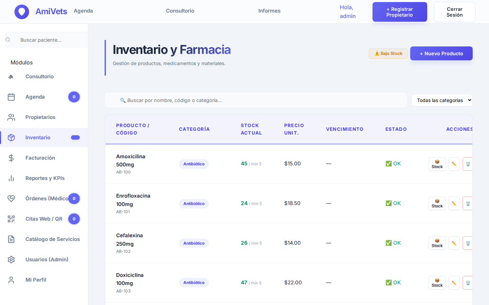

### 2. Vacíos que no son "falta de seed data" sino dependencias rotas

Se pidió no sembrar datos y no lo hice — pero vale la pena separar qué vacíos
son reales y cuáles son bugs de entorno, porque cambian la lectura del
diagnóstico:

- **Citas Web / QR → Citas Recibidas** no muestra una tabla vacía: muestra un
  error (`Error: Supabase no configurado (SUPABASE_URL / SUPABASE_SECRET_KEY)`)
  renderizado sin estilo dentro de la fila de la tabla. Es un error de
  configuración de entorno, no de UI, pero como pantalla es exactamente el
  "estado de error sin diseñar" que la Fase 1 tiene que resolver.
- **Citas Web / QR → Veterinarios** y **la página pública `/agendar`** están
  vacías ("No hay veterinarios activos" / "No hay veterinarios disponibles")
  porque los diez usuarios médicos sembrados (`dr_pérez`, `dr_garcía`, …)
  tienen `role = "user"` en la base actual, no `role = "veterinario"`. El
  propio `backend/scripts/seed_data.py` lo anticipa en un comentario (línea
  ~48): la corrección de rol solo corre si el usuario se crea de cero, y como
  la base ya tiene más de 200 consultas el seeding temprano se saltea, así que
  ese fix nunca se aplicó a los usuarios existentes. Esto **no lo toqué** —
  ni la base ni el script — pero explica por qué el flujo estrella de QR
  público, tal como está sembrada la base hoy, no se puede demostrar
  funcionando de punta a punta.
- **Agenda** solo tiene **una cita real cargada en toda la base** (confirmado
  contra `/api/citas/`, no contra la UI). Las 200+ consultas del seed son
  fichas clínicas cargadas directamente, no pasaron por el flujo de agenda.
  El calendario de agosto de 2026 (mes actual) aparece vacío; hubo que
  retroceder hasta abril de 2026 para encontrar el único evento cargado.
  Documentar la sección "Agenda" con este dato es honesto: hoy, con los datos
  que hay, es una pantalla casi vacía en el uso real, aunque el resto de la
  app esté llena.

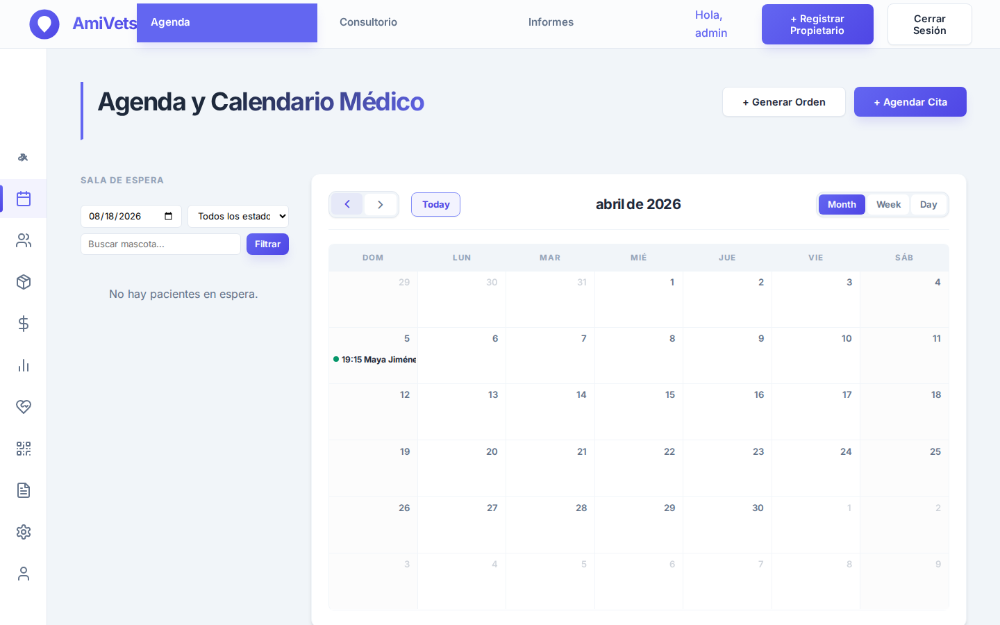

### 3. Dos bugs silenciosos que solo aparecen recorriendo la app

- **`kpiStock`** (tarjeta "Bajo Stock" en Reportes y KPIs) tiene el `id` en el
  HTML pero ningún script en `app.js` lo escribe. Queda en `0` para siempre,
  sin importar el inventario real.
- **`profileEmail`** (Mi Perfil → "Correo Electrónico") tiene el mismo
  problema: el `
` existe, pero no hay una sola línea en
  `app.js` que lo llene. El campo queda visualmente vacío debajo de la
  etiqueta, para cualquier usuario.

Ninguno de los dos es visible leyendo el HTML aislado — solo aparecen viendo
la pantalla renderizada con la sesión abierta, que es exactamente el punto de
esta fase.

---

## Recorrido por sección

### Login (`/login.html`)

**Quién la usa:** todo el mundo, una vez por sesión.

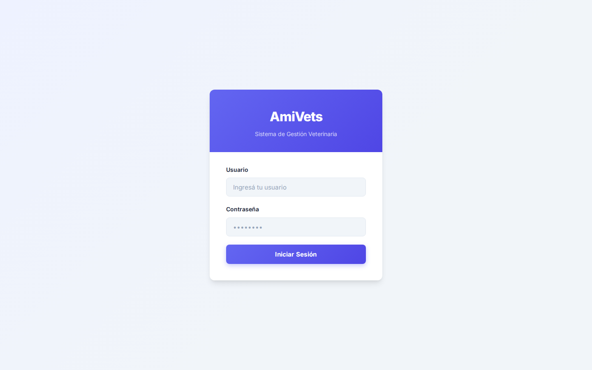

Es la muestra más pura de "plantilla de dashboard por defecto": tarjeta
centrada con degradado `indigo → indigo-oscuro` de cabecera, blanco abajo,
fondo con un degradado sutil genérico. No hay nada de AmiVets acá salvo el
nombre — podría ser el login de cualquier SaaS. Vale la pena que la Fase 1 la
trate como una pantalla más a rediseñar, no como algo secundario: es la
primera impresión.

### Consultorio (`sec-consultorio`) — landing real de la app

**Qué hace:** ficha clínica del paciente — buscar mascota, ver su historia
clínica, registrar consultas, vacunas, desparasitaciones, hospitalizaciones,
cirugías, recetas y facturar desde ahí.
**Quién la usa:** veterinario (durante la consulta) y recepcionista (para
ubicar al paciente).

Nota de arquitectura: aunque el link de "Agenda" aparece marcado como activo
en el HTML estático del menú superior (línea 34 de `index.html`), la sección
que de verdad se muestra al cargar la app es Consultorio —
`app.js` fuerza esa selección al iniciar (líneas 505-508). Es un detalle
menor pero es exactamente el tipo de inconsistencia que un rediseño de
arquitectura de información debería resolver de una vez: cuál es la pantalla
de inicio real.

**Clics de la tarea más frecuente** (ver una ficha clínica): 1 clic sobre el
paciente en la lista → listo, se abre "Historia Clínica" por defecto. Para
cargar una consulta nueva: paciente (1) → botón "Registrar Consulta" (2) →
completar formulario → enviar (3). Es de las tareas más baratas en clics de
toda la app.

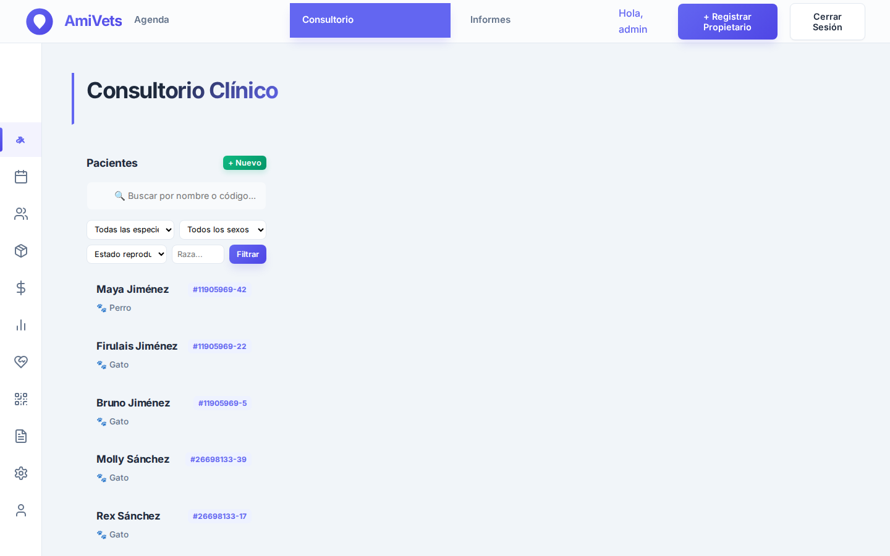
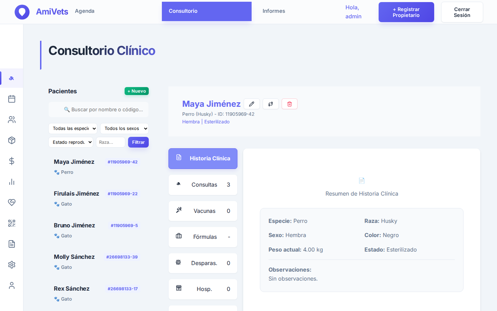

**Patrón distinto al resto:** la lista de pacientes es de **tarjetas** (nombre,
código, especie), no una tabla — mientras que Propietarios, Inventario,
Facturación, Catálogo y Usuarios listan la misma clase de dato maestro en
**tablas**. Mismo tipo de contenido (listado con búsqueda + filtros + acción),
dos resoluciones visuales distintas sin razón aparente.

**Color fuera de línea:** el botón "+ Nuevo" (junto a "Pacientes") usa
`var(--secondary)` — verde, la misma familia de color que "Activo" o "OK" en
el resto de la app — mientras que todos los demás botones de creación
("+ Registrar Propietario", "+ Nuevo Producto", "+ Nuevo Servicio", "+ Nuevo
Usuario", "+ Agendar Cita") usan `var(--primary)`, el indigo. Es la misma
acción semántica (crear un registro) resuelta con dos acentos distintos —
justo lo que la Fase 1 tiene que evitar ("un acento usado con avaricia").

**Vista desde rol veterinario:** confirmé que `dr_pérez` ve exactamente la
misma pantalla que `admin` en Consultorio — no hay ninguna adaptación por rol
acá, aunque el propio código sí distingue `isAdmin` en el formulario de
consulta (línea 1244-1245 de `app.js`) para decidir si el veterinario se
autocompleta o se elige de una lista.

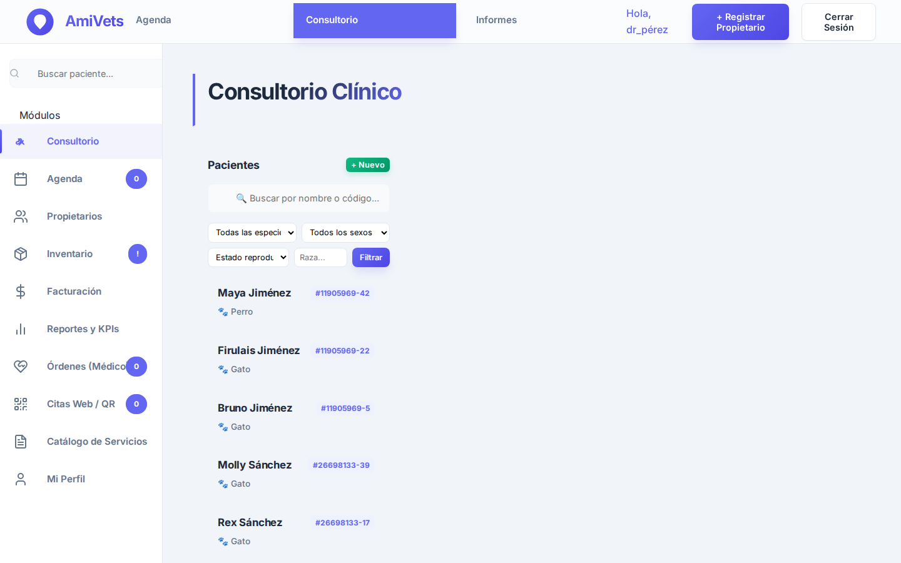

### Agenda (`sec-agenda`)

**Qué hace:** calendario médico (FullCalendar) con sala de espera, generación
de órdenes y agendamiento de citas.
**Quién la usa:** recepcionista (agenda y hace check-in) y veterinario
(consulta su día).

**Clics de la tarea más frecuente hoy** — dado que la sala de espera y el
calendario están casi vacíos, la tarea real más común es *crear* una cita:
"+ Agendar Cita" (1) → buscar/elegir mascota (2) → fecha y hora (3) → motivo
(4) → elegir médico (5) → enviar (6). Seis interacciones para un turno, sin
poder reusar los datos del paciente ya cargados en Consultorio — el buscador
del modal es independiente.

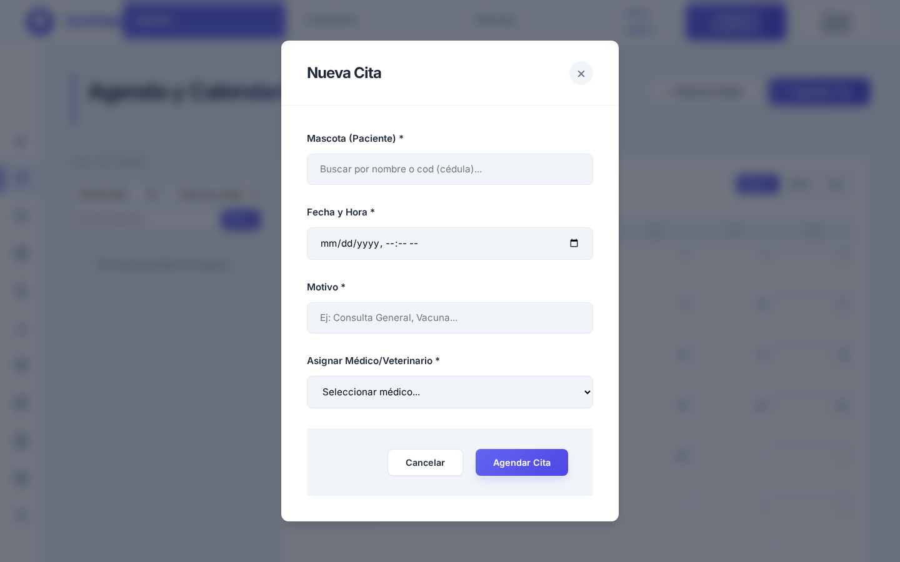

**Densidad:** el calendario mensual de FullCalendar con su estilo de fábrica
convive sin ningún ajuste visual con el resto de la app — bordes, tipografía
y espaciado de la librería no están tocados. Es la dependencia visual más
notoria de toda la interfaz (junto con Chart.js, ver más abajo en Reportes).

**Patrón repetido, resuelto igual que en otras secciones:** el filtro por
fecha + estado + búsqueda de mascota, en la barra lateral izquierda, es
prácticamente el mismo patrón de filtros de Inventario/Catálogo pero
apilado verticalmente en vez de en una fila horizontal — otra variación sin
necesidad aparente.

### Propietarios (`sec-propietarios`)

**Qué hace:** alta y listado de dueños de mascotas, acceso a "Mascotas" de
cada uno.
**Quién la usa:** recepcionista, principalmente al ingresar un cliente nuevo.

**Clics de la tarea más frecuente** (buscar un propietario y ver sus
mascotas): escribir en el buscador (no cuenta como clic) → clic en "Mascotas"
de la fila (1 clic). Registrar uno nuevo: "+ Nuevo Propietario" (1) → llenar
modal → guardar (2).

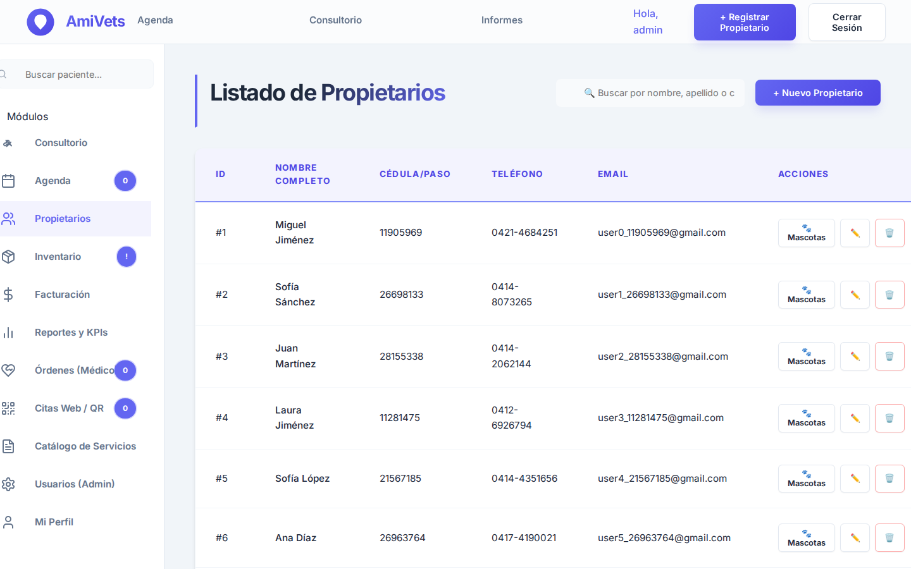

**Densidad:** el input de búsqueda ("Buscar por nombre, apellido o c...") es
demasiado angosto para su propio placeholder — el texto se corta a media
palabra. Un detalle chico, pero es el tipo de cosa que una interfaz
"pensada con espacio de marketing" (según lo describe la tarea) deja pasar:
el ancho del campo no se pensó en función de lo que hay que escribir ahí
adentro.

**Plantilla genérica:** tabla con cabecera en indigo claro sobre fondo blanco,
idéntica receta visual que Inventario, Facturación, Catálogo y Usuarios —
correcto como consistencia, pero es *la* tabla de dashboard genérica sin
ningún matiz propio (ni jerarquía tipográfica entre columnas primarias y
secundarias, ni agrupación visual de acciones destructivas vs. no
destructivas).

### Inventario (`sec-inventario`)

**Qué hace:** stock y farmacia — productos, cantidades, vencimientos, alertas
de bajo stock.
**Quién la usa:** recepcionista/auxiliar para reponer stock; veterinario
indirectamente al recetar.

**Clics de la tarea más frecuente** (revisar o ajustar stock de un producto):
localizar la fila (búsqueda o scroll) → clic en "Stock" (1 clic) → modal de
movimiento → guardar (2). El botón "Stock" ya está cortado del viewport en
1440px (ver hallazgo transversal #1), así que en la práctica hace falta achicar
el zoom del navegador o la ventana para llegar a él.

**Densidad:** siete columnas (`Producto/Código`, `Categoría`, `Stock actual`,
`Precio unit.`, `Vencimiento`, `Estado`, `Acciones`) en una tabla sin
truncamiento de contenido ni prioridad visual — todo pesa igual. Con AmoxicIlina,
Enrofloxacina, Cefalexina, etc. cargadas, el patrón "Producto / Código" ya
ocupa dos líneas por fila: la tabla es alta y ancha a la vez.

### Facturación (`sec-facturacion`)

**Qué hace:** historial de comprobantes emitidos — no genera facturas nuevas
desde acá. La factura se emite desde la consulta puntual en Consultorio
(`facturarConsulta`, `app.js` línea 2989), no desde este listado.
**Quién la usa:** recepcionista, para consultar cobros; dueño de la clínica,
para revisar caja.

**Clics de la tarea más frecuente** (ver el PDF de una factura ya emitida):
localizar la fila → "Ver PDF" (1 clic). Pero para *emitir* una factura nueva —
la tarea que de verdad mueve dinero — hay que ir a Consultorio, encontrar al
paciente, encontrar la consulta puntual y facturar desde ahí: la sección
"Facturación" del menú no tiene ningún botón de creación, a diferencia de
absolutamente todas las demás (que sí tienen su "+ Nuevo X" arriba a la
derecha). Es una ruptura de patrón que vale la pena que Daniel confirme si es
intencional o accidental antes de la Fase 2.

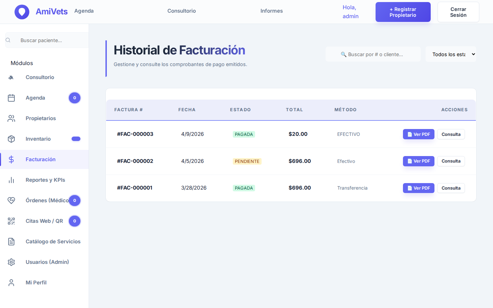

**Densidad e inconsistencia de datos:** los montos (`$20.00`, `$696.00`) no
usan cifras tabulares — a simple vista, comparar montos en la columna
requiere leer cada número, no solo mirar la alineación. El método de pago
también mezcla mayúsculas y formato libre en el mismo dataset
("EFECTIVO", "Efectivo", "Transferencia") — no es decisión del frontend, pero
sí es algo que el nuevo sistema de tipografía/tablas debería normalizar
visualmente aunque el dato llegue así.

### Reportes y KPIs (`sec-reportes`)

**Qué hace:** tres tarjetas — Citas Hoy, Pacientes Atendidos, Bajo Stock.
**Quién la usa:** dueño de la clínica, al cerrar el día o el mes (en teoría).

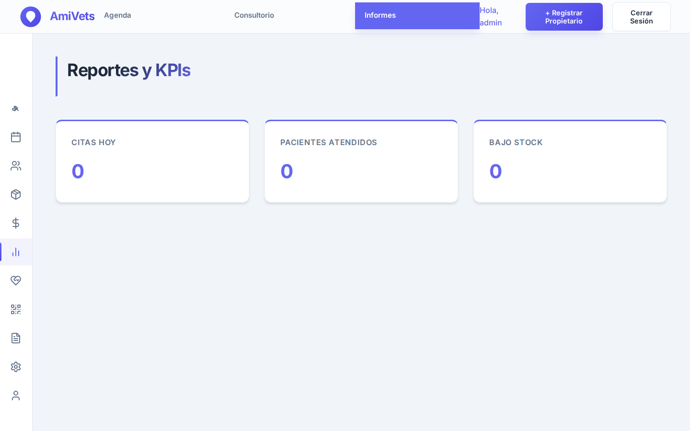

**Esto es todo lo que hay.** No hay gráficos, no hay comparación con período
anterior, no hay filtro de fecha. Chart.js está cargado en el `<head>` de
`index.html` y sí se usa — pero en el gráfico de peso de la ficha del
paciente, no acá. "Reportes y KPIs" es, hoy, tres números sin contexto, uno de
los cuales (`kpiStock`) nunca se actualiza (ver hallazgo transversal #3), y
otros dos que muestran `0` honestamente porque filtran por "hoy" y hoy no hay
citas ni consultas cargadas. Para una clínica que "cierra el mes" —como dice
la tarea que hace el dueño— esta pantalla no sirve todavía ni de lejos: es la
sección más desproporcionada entre lo que promete el nombre ("Reportes y
KPIs") y lo que entrega.

### Órdenes (Médico) (`sec-ordenes-medico`)

**Qué hace:** cola de consultas pendientes asignadas al veterinario logueado.
**Quién la usa:** veterinario, para saber a quién atender.

Confirmé con `admin` y con `dr_pérez` — ambos ven "No tiene órdenes
pendientes" porque el filtro depende de citas con `estado === 'pendiente'`, y
como se documentó arriba, solo existe una cita en toda la base. La pantalla
en sí es mínima: una tarjeta KPI ("Pendientes") y una lista debajo. Es de las
secciones estructuralmente más simples de las once — buena candidata para
empezar la Fase 3, tal como sugiere la tarea.

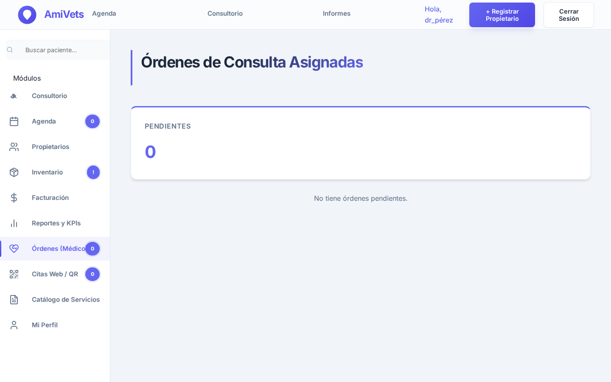

**Clics de la tarea más frecuente** (atender una orden): 1 clic sobre la
orden en la lista, que dispara `atenderOrden()` y navega a Consultorio con el
paciente ya cargado — el flujo entre estas dos secciones sí está bien resuelto
cuando hay datos.

### Citas Web / QR (`sec-citas-web`)

**Qué hace:** tres pestañas — Citas Recibidas (turnos pedidos por QR),
Horarios (bloques de disponibilidad por veterinario), Veterinarios (alta y
listado de médicos habilitados para el QR público).
**Quién la usa:** recepcionista/administración, para gestionar la demanda que
entra por el link público.

Ya se documentó arriba que **las tres pestañas están efectivamente vacías o
rotas** con los datos actuales: "Citas Recibidas" muestra el error de
Supabase, "Veterinarios" no lista a nadie por el problema de rol, y
"Horarios" no tiene con quién trabajar en consecuencia.

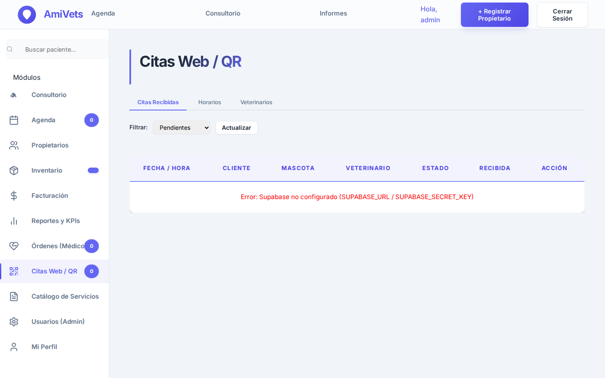
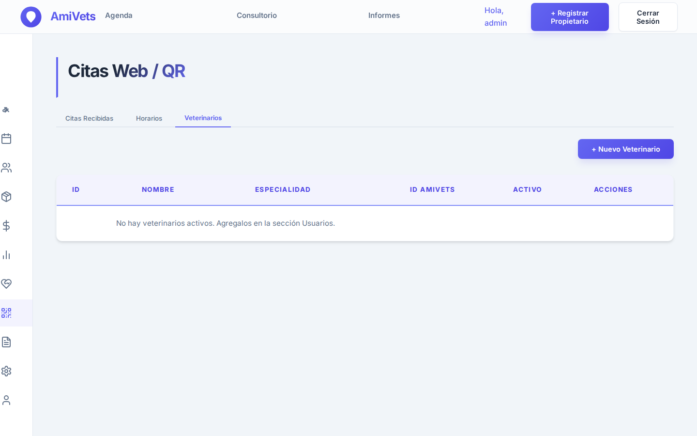
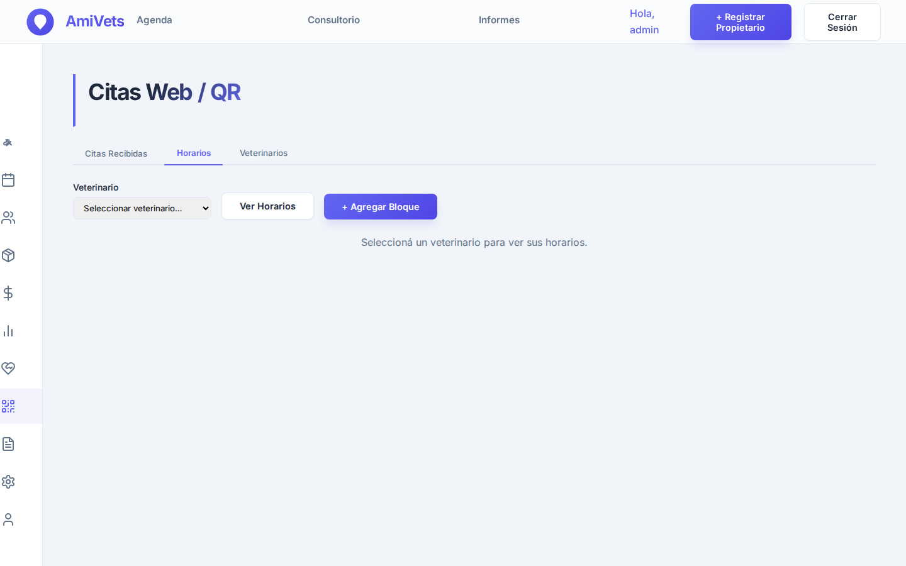

**Patrón:** las pestañas internas (`Citas Recibidas` / `Horarios` /
`Veterinarios`) son el único lugar de toda la app que usa navegación por tabs
dentro de una sección — Consultorio resuelve un problema parecido (varias
vistas de un mismo paciente) con una fila de botones tipo tarjeta en vez de
tabs. Dos soluciones de navegación secundaria para el mismo problema de
información.

### Catálogo de Servicios (`sec-catalogo`)

**Qué hace:** precios y categorías de servicios (consultas, cirugías,
laboratorio, hospitalización) que se usan al facturar.
**Quién la usa:** dueño de la clínica / administración, para mantener precios
actualizados.

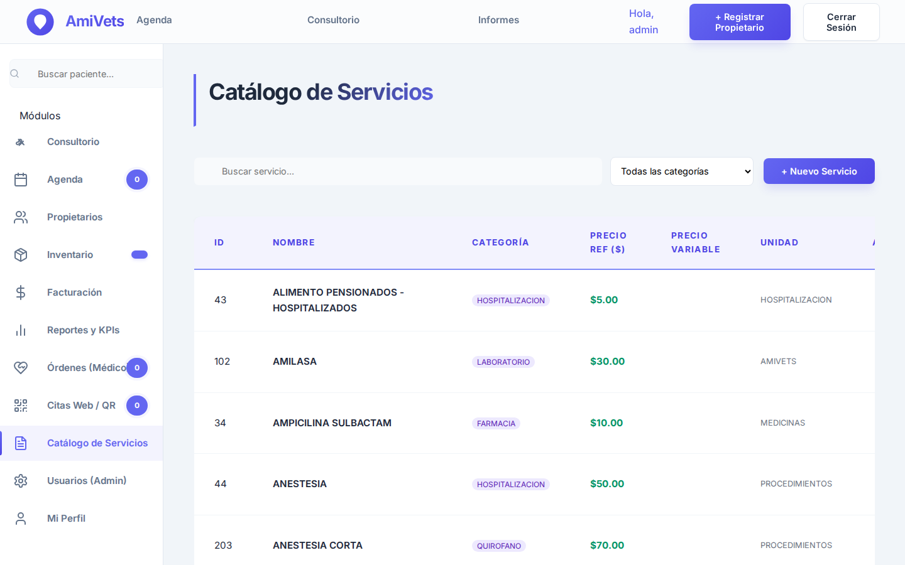

**Clics de la tarea más frecuente** (actualizar el precio de un servicio):
localizar la fila → clic en editar (recortado del viewport, mismo problema
que Inventario) → modal → guardar. **Densidad:** seis columnas visibles más
"Acciones" cortada; la columna "Precio Variable" aparece vacía para casi
todos los servicios listados (Amilasa, Ampicilina Sulbactam, Anestesia,
Anestesia Corta) — no quedó claro desde la UI si ese campo es opcional por
diseño o si es otro dato que no se está completando en el alta.

### Usuarios — Admin (`sec-usuarios`)

**Qué hace:** alta, edición, desactivación y borrado de usuarios del sistema.
**Quién la usa:** únicamente `admin` — el único ítem de menú con clase
`admin-only` y `display: none` por defecto en el HTML.

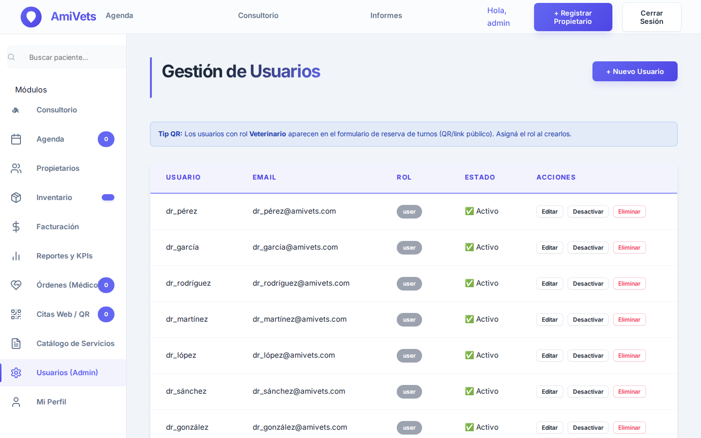

Acá se ve, con datos reales, el problema de rol descripto en el hallazgo
transversal #2: los diez médicos sembrados figuran con badge de rol **"user"**,
gris, no "veterinario". El aviso propio de la pantalla ("Tip QR: los usuarios
con rol Veterinario aparecen en el formulario de reserva de turnos...") es
correcto y hasta útil como UX — pero contradice lo que la tabla de abajo
muestra, porque los diez usuarios visibles no cumplen esa condición. Esta
sección, sin querer, es la que mejor explica el porqué del QR vacío en el
resto de la app.

**Clics de la tarea más frecuente** (activar/desactivar un usuario): 1 clic
sobre "Desactivar"/"Activar" en la fila. Es de las acciones más baratas de
toda la app.

### Mi Perfil (`sec-perfil`)

**Qué hace:** datos del usuario logueado y cambio de contraseña.
**Quién la usa:** cualquier usuario.

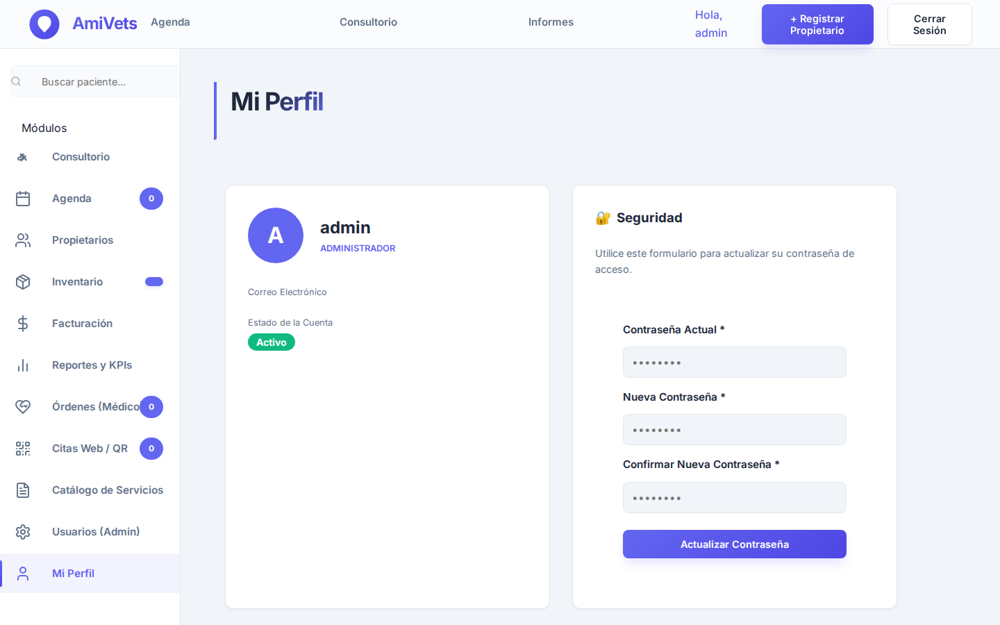

Ya documentado arriba (hallazgo transversal #3): el campo "Correo
Electrónico" queda en blanco para cualquier usuario porque nada en `app.js`
completa `#profileEmail`. **Patrón:** el formulario de cambio de contraseña
(tres campos apilados) es el formulario más simple y mejor logrado de la app
— corto, con `*` de obligatorio, sin agrupar de más porque no hace falta. Vale
la pena usarlo como referencia de "lo mínimo que ya funciona bien" al diseñar
el resto.

---

## Página pública `/agendar` (QR, sin login)

**Quién la usa:** el dueño de la mascota, una vez, desde el celular, sin
ayuda de nadie — como aclara la tarea.

**Nota de ruta:** el archivo se llama `static/agendar.html` pero **no se sirve
en esa URL**. La ruta real, definida en `backend/app/main.py` (línea 246), es
`/agendar` (sin `.html`); pedir `/agendar.html` devuelve un 404 de FastAPI
(`{"detail":"Not Found"}`). Es un detalle a tener en cuenta si en la Fase 3
se genera o valida algún link/QR apuntando al archivo por nombre en vez de a
la ruta del backend.

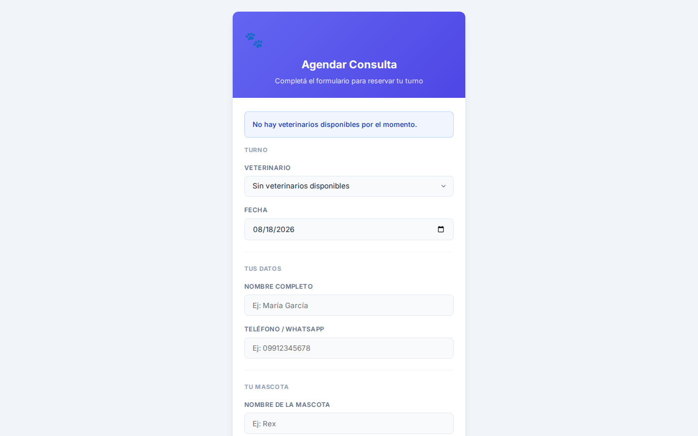
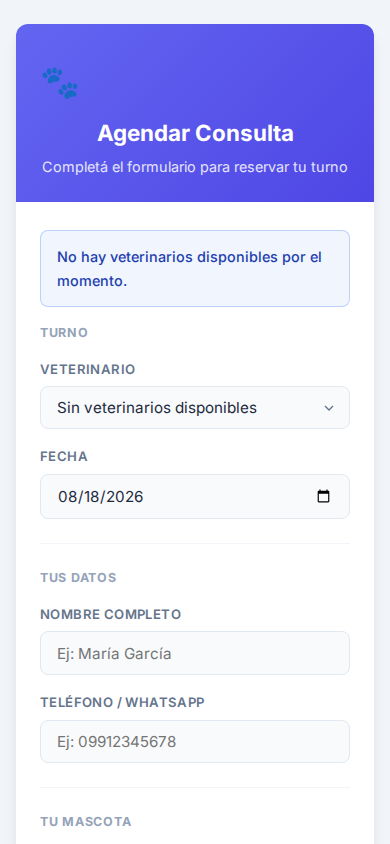

**Qué tan vacía/espaciada es hoy:** a diferencia del interior clínico, este
formulario **ya agrupa los campos en tres bloques** ("Turno", "Tus Datos",
"Tu Mascota") con etiquetas en mayúscula pequeña — es, comparado con el resto
de la app, la pantalla mejor estructurada de todo el sitio en términos de
jerarquía de formulario. El problema hoy no es de diseño sino de datos: como
ningún veterinario tiene `role = "veterinario"`, el selector muestra "Sin
veterinarios disponibles" y el aviso "No hay veterinarios disponibles por el
momento" — el flujo no se puede completar de punta a punta con los datos
actuales de la base.

**Plantilla genérica:** comparte la misma cabecera con degradado indigo que
el login — refuerza que ese degradado es, literalmente, el color por defecto
de la plantilla base y no una decisión de marca.

---

## Síntesis: patrones repetidos y densidad, transversal a las once secciones

**Mismo problema, resuelto distinto, sin razón declarada:**

| Necesidad | Cómo se resuelve, y dónde |
| --- | --- |
| Listado maestro con búsqueda + acción | Tarjetas verticales en Consultorio; tabla en Propietarios, Inventario, Facturación, Catálogo, Usuarios |
| Navegación secundaria dentro de una sección | Tabs de texto en Citas Web/QR; fila de botones tipo tarjeta en Consultorio (Historia Clínica / Consultas / Vacunas / …) |
| Filtros de una tabla | Fila horizontal en Inventario/Catálogo; columna vertical en la barra lateral de Agenda |
| Botón de "crear registro" | Indigo (`--primary`) en Propietarios, Inventario, Facturación (ausente), Catálogo, Usuarios, Agenda; verde (`--secondary`) solo en Consultorio |
| Crear una factura | No hay botón en la sección "Facturación" — se hace desde dentro de Consultorio |

**Dónde la densidad estorba, en un vistazo:**

- Inventario y Catálogo: la última columna (Acciones) queda fuera del
  viewport a 1440px, sin scroll horizontal posible (`overflow: hidden` en el
  contenedor raíz).
- Ningún importe de la app usa `font-variant-numeric: tabular-nums` —
  Facturación y Catálogo muestran montos que no se pueden comparar de un
  vistazo, algo que la tarea ya identificó como requisito de la Fase 1.
- El formulario más largo de la app interna (alta de mascota, no capturado
  acá por no ser una de las once secciones pero visible en el modal
  correspondiente) no agrupa campos por bloques; el formulario público de
  `/agendar`, en cambio, sí lo hace — la web pública, pensada para un usuario
  de una sola vez, terminó mejor estructurada que el sistema que usa el
  equipo interno ocho horas por día.

**Qué se ve heredado de una plantilla de dashboard genérica, con precisión:**

- El degradado indigo → indigo-oscuro de las cabeceras de tarjeta (login y
  `/agendar`) es el recurso visual más reconocible de "plantilla admin
  gratuita" de los últimos años — cero relación con una clínica veterinaria.
- La tabla de datos (cabecera lila pálido, texto indigo en mayúsculas,
  filas blancas alternadas) se repite igual en cinco secciones sin ninguna
  variación editorial: incluso semánticamente distintas (dinero vs.
  inventario vs. permisos de usuario), todas usan el mismo tratamiento visual.
- Los íconos de línea (Lucide, por la forma de los `<path>` en el SVG) son
  genéricos y consistentes entre sí, pero no dicen nada de una veterinaria —
  el ícono de "Consultorio" es un hueso, correcto, pero "Facturación" es un
  signo de dólar dentro de una "S" de billete, "Reportes" son barras de
  gráfico: exactamente el set de íconos que trae cualquier plantilla de
  dashboard por defecto.
- La barra lateral colapsa a solo íconos (68px) y se expande a 260px
  **solo con hover del mouse** (`static/css/styles.css`, `.sidebar:hover`).
  Es un patrón clásico de dashboard de escritorio pensado para mouse, y hoy
  no tiene ninguna alternativa por teclado ni touch: en una tablet (uso
  plausible en un mostrador clínico) el usuario ve solo íconos sin etiqueta,
  todo el tiempo.

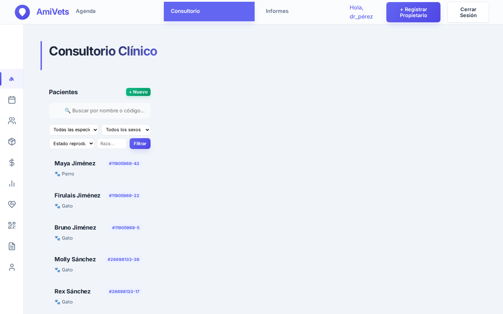

---

## Lo que esta fase deja para la Fase 2 (no se decide acá)

- Confirmar con Daniel si "Facturación" debería tener su propio punto de
  entrada para crear una factura, o si el flujo "se factura desde la
  consulta" es intencional y solo falta comunicarlo mejor.
- Decidir qué hacer con "Reportes y KPIs": hoy no cumple lo que promete su
  nombre ni para un dueño que cierra el mes ni para nadie más.
- Definir si Consultorio (landing real) y Órdenes (Médico) deberían
  fusionarse — sirven al mismo usuario (veterinario) en el mismo momento del
  día y hoy compiten por atención en el menú.
- El problema de rol de los usuarios sembrados (`role = "user"` en vez de
  `"veterinario"`) no es un problema del frontend, pero cualquier demo o
  captura futura de "Citas Web/QR" y de `/agendar` va a seguir vacía hasta que
  se corrija en la base — vale la pena que quede anotado para quien retome
  esa parte, sea backend o seeding.
