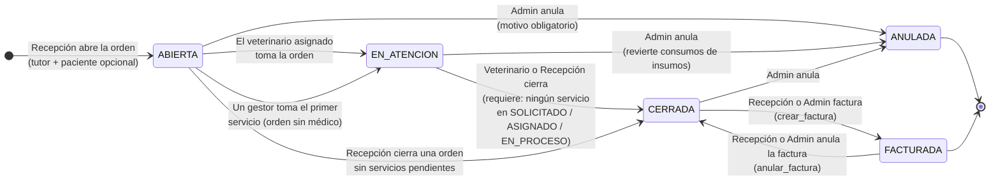
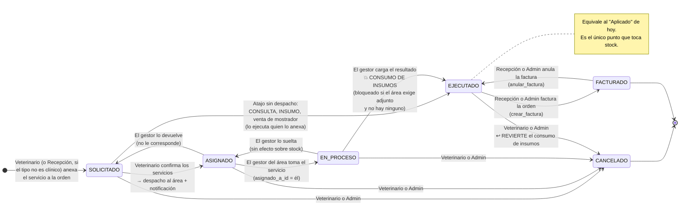

# Órdenes de servicio — Diseño (Tarea 06, FASE 1)

> FASE 1 de `docs/tareas/06-sistema-por-ordenes-de-servicio.md`. **No se escribe
> código de aplicación ni migraciones hasta que las nueve decisiones estén
> aprobadas.** Este documento fija cada decisión, su fundamento verificado contra
> el código de la rama `redesign/minimalist-ui`, y las alternativas descartadas.
>
> Esta tarea **absorbe la Tarea 09** (`docs/diseno/flujo-consulta-servicios.md`),
> que ya está implementada. Lo que sigue no ignora ese diseño: lo extiende. Donde
> lo contradice, lo dice y explica por qué.

---

## 0. Estado real del código — verificado, no asumido

### 0.1 Lo que la Tarea 09 ya dejó hecho

No es teoría: está en la base y en el modelo.

| Hecho | Evidencia |
|---|---|
| `ServicioConsulta.consulta_id` es nullable | `models.py:219` |
| `ServicioConsulta.mascota_id` existe y se llena siempre | `models.py:223`, `consultas.py:200` |
| CHECK `ck_servicio_consulta_scope` (`consulta_id IS NOT NULL OR mascota_id IS NOT NULL`) | `models.py:206-210` |
| `ServicioConsulta.origen` como marcador de reversibilidad del backfill | `models.py:227` (`'MIGRACION_09'`) |
| `Consulta.estado` (`ABIERTA`/`CERRADA`/`ANULADA`) | `models.py:161` |
| `/api/servicios` (servicio directo, sin consulta) | `routers/servicios.py:157` |
| Doble conteo en facturación **ya cerrado** | `facturacion_service.py:434-439` |
| `POST /api/facturas/from-consulta/{id}` | `routers/facturas.py:35` |
| Rol `recepcionista` en `ROLES_VALIDOS` | `usuarios.py:71` |
| Migración aplicada en arranque (`stamp` o `upgrade head`) | `core/db_migrate.py:32-51` |

**Consecuencia para esta tarea:** el trabajo pesado del carrito heterogéneo ya
está hecho. Lo que falta es el **contenedor** (la orden), el **despacho** (gestor,
bandeja, notificación), los **adjuntos**, y el **gate de seguridad** que hoy no
existe.

### 0.2 El bug de `require_roles` — confirmado

`backend/app/routers/usuarios.py:86-97`:

```python
async def _dep(
    current_user: Optional[Usuario] = Depends(get_optional_current_user),
) -> Optional[Usuario]:
    if current_user is not None and current_user.role not in roles:
        raise HTTPException(status_code=403, ...)
    return current_user
```

`get_optional_current_user` (`usuarios.py:42-57`) devuelve `None` cuando no hay
token **o cuando el token es inválido** — nunca levanta 401. Con `current_user =
None` la condición corta en el primer operando y la petición **pasa**.

El resultado es exactamente al revés de lo que uno espera de un guard:

- Usuario logueado con rol equivocado → **403**.
- Petición sin token → **200**.
- Petición con token basura → **200**.

Está documentado como deliberado en el docstring (`usuarios.py:76-84`), lo que lo
hace peor, no mejor: es una puerta abierta con un cartel que dice "es a propósito".

**Detalle agravante:** el mismo agujero está replicado una capa más abajo en
`servicios.py:56`:

```python
if current_user is None or current_user.role != "recepcionista":
    return          # ← sin sesión, pasa sin restricción de tipo
```

Una petición anónima puede anexar una cirugía. El chequeo de rol de la Tarea 09
solo aplica a recepcionistas logueadas.

### 0.3 Endpoints que usan `require_roles` hoy

Los nueve, todos alcanzables **sin token**:

| # | Endpoint | Archivo:línea | Roles declarados |
|---|---|---|---|
| 1 | `POST /api/consultas/{consulta_id}/recetas` | `consultas.py:115-120` | admin, veterinario |
| 2 | `POST /api/clinico/vacunacion` | `clinico.py:31-35` | admin, veterinario |
| 3 | `POST /api/clinico/desparasitacion` | `clinico.py:119-123` | admin, veterinario |
| 4 | `POST /api/clinico/hospitalizacion` | `clinico.py:185-189` | admin, veterinario |
| 5 | `POST /api/clinico/cirugia` | `clinico.py:234-238` | admin, veterinario |
| 6 | `POST /api/clinico/prueba_complementaria` | `clinico.py:281-285` | admin, veterinario |
| 7 | `POST /api/cirugias/` | `cirugias.py:12-16` | admin, veterinario |
| 8 | `POST /api/hospitalizaciones/` | `hospitalizaciones.py:12-16` | admin, veterinario |
| 9 | `POST /api/pruebas/` | `pruebas.py:12-16` | admin, veterinario |

### 0.4 El agujero más grande: endpoints sin guard alguno

`require_roles` es el bug visible. El problema real es lo que **ni siquiera lo
usa**. Estos escriben datos clínicos o de negocio y no tienen ninguna dependencia
de autorización:

| Endpoint | Archivo:línea | Guard actual |
|---|---|---|
| `POST /api/consultas/` | `consultas.py:27-31` | ninguno |
| `PUT /api/consultas/{id}` | `consultas.py:77` | ninguno |
| `POST /api/consultas/{id}/servicios` | `consultas.py:177-182` | solo el filtro de tipo para recepcionista |
| `PATCH /api/consultas/servicios/{id}` | `consultas.py:231` | ninguno |
| `DELETE /api/consultas/servicios/{id}` | `consultas.py:260` | ninguno |
| `POST /api/servicios/` | `servicios.py:157-161` | solo el filtro de tipo |
| `PATCH /api/servicios/{id}` | `servicios.py:263-268` | ninguno |
| `DELETE /api/servicios/{id}` | `servicios.py:273-277` | ninguno |
| `POST /api/citas/` | `citas.py:17-20` | ninguno (intencional, ver §9.4) |
| `PUT /api/hospitalizaciones/{id}/dar-alta` | `hospitalizaciones.py:58-59` | ninguno |
| `PUT` / `DELETE /api/pruebas/{id}` | `pruebas.py:84-103` | ninguno |

Montar bandejas de gestor sobre esto sería decorativo. Por eso el arreglo es la
**etapa 1 de FASE 2, sola y con la suite en verde antes de seguir**.

### 0.5 Archivos: no hay carga, hay una URL a mano

Confirmado: **cero `UploadFile`, cero `File(`, cero `multipart` en todo
`backend/`**. Pero el enunciado ("columnas que nadie escribe") necesita un
matiz — lo verifiqué y es media verdad:

- `PruebaComplementaria.archivo_url` (`models.py:291`) **sí se escribe**: hay un
  input de texto libre "URL Resultado" en `static/js/sections/consultorio.js:1981`
  que viaja por el schema (`schemas.py:298,313`) y lo persiste
  `clinico.py:294`. Es una URL tipeada a mano, no un archivo subido.
- **Hallazgo de seguridad colateral:** ese valor se interpola crudo dentro de un
  `href` en `consultorio.js:1827`
  (`<a href="${d.archivo_url}" ...>`). Un valor tipeado como `javascript:...` o
  con una comilla queda como XSS almacenado. Hay que arreglarlo cuando se toque
  esto (Decisión 7).
- `ConsentimientoInformado.archivo_adjunto_url` (`models.py:623`) **sí está
  muerta**: no existe router de consentimientos, ningún código la escribe ni la
  lee.
- `backend/scripts/seed_extra.py:81` siembra URLs de Cloudinary de ejemplo.

### 0.6 El despliegue real — lo que decide la Decisión 8

Dos hechos verificados que descalifican `static/uploads/`:

1. **nginx sirve `static/` directo del disco, salteando FastAPI.**
   `nginx/nginx.conf`: `location /static/ { alias /usr/share/nginx/html/static/; }`
   y `docker-compose.yml` monta `./static:/usr/share/nginx/html/static:ro`.
   Todo lo que caiga bajo `static/` es público para quien alcance el puerto 80.
   El requisito "que el archivo no se sirva sin verificar quién lo pide" es
   **literalmente insatisfacible** ahí sin cambiar nginx.
2. **En producción el backend no tiene volumen para `static/`.** El `Dockerfile`
   hace `COPY static/ /app/static/` (lo hornea en la imagen) y el único montaje
   de `./static` vive en `docker-compose.override.yml`, que declara en su primera
   línea: *"NOT used in production / Render"*. Un archivo escrito ahí **muere en
   el siguiente redeploy** y nunca entra al respaldo: el único volumen nombrado
   es `postgres_data`.

Otros datos del despliegue que importan:

- `nginx.conf`: `client_max_body_size 20M` — techo duro del cuerpo de la petición.
- `python-multipart==0.0.6` **ya está** en `requirements.txt` (líneas 4 y 21 —
  duplicado, conviene limpiarlo). `UploadFile` funciona hoy sin agregar nada.
- No hay `python-magic` ni `filetype`. Si se quiere sniffing de tipo real hay que
  hacerlo con stdlib o sumar dependencia (ver Decisión 8).

### 0.7 Facturación y liquidaciones — lo que no se puede romper

- `Factura.consulta_id` es nullable (`models.py:400`), con índice único parcial
  `WHERE estado != 'ANULADA'` (migración `e5f6a7b8c9d0`) y guard de 409 en
  `crear_factura` (`facturacion_service.py:78-91`).
- `crear_factura` marca `facturado=True` en **cualquier** `ServicioConsulta`
  referenciado por una línea, tenga consulta o no
  (`facturacion_service.py:198-206`) — el camino de servicios sueltos ya existe.
- `anular_factura` revierte todo eso y **reabre la consulta**
  (`facturacion_service.py:357-373`).
- `LiquidacionDetalle.consulta_id` es **`unique` + `NOT NULL`**
  (`models.py:493`).
- `_consultas_elegibles` (`liquidaciones.py:22-45`) hace
  `JOIN Factura ON Factura.consulta_id == Consulta.id` con
  `Factura.estado == "PAGADA"` y `Consulta.veterinario_id == vet`.

→ **La liquidación depende de que la factura de una consulta siga llevando
`consulta_id`.** Es la restricción que gobierna la Decisión 3.

### 0.8 Consumo de insumos — dónde se dispara hoy

Tarea 07, decisión 3 (`docs/diseno/inventario-fraccionado.md:90-97`): *"Al
aplicar el servicio. El momento es la transición de `ServicioConsulta` a
`estado == "Aplicado"`."*

Implementado en:

| Punto | Archivo:línea |
|---|---|
| Alta de servicio en consulta, si entra `Aplicado` | `consultas.py:216-221` |
| Alta de servicio directo, si entra `Aplicado` | `servicios.py:195-201` |
| `no-Aplicado → Aplicado` (consume) | `servicios.py:114-120` |
| `Aplicado → no-Aplicado` (revierte) | `servicios.py:121-122` |
| Soft-delete de un aplicado (revierte) | `servicios.py:143-146` |
| Guard anti-doble-descuento al facturar | `facturacion_service.py:14-45` |

El literal `"Aplicado"` es carga estructural en ~8 sitios. Eso gobierna la
Decisión 4.

### 0.9 Convención de migraciones

Cadena de revisiones actual, `head = e1f2a3b4c5d6`:

```
8ae206b11dda → 6d4c5b3a2e1f → 9f8e7d6c5b4a → a1b2c3d4e5f6 → b2c3d4e5f6a7
→ c3d4e5f6a7b8 → d4e5f6a7b8c9 → e5f6a7b8c9d0 → f6a7b8c9d0e1
→ a7b8c9d0e1f2 → b8c9d0e1f2a3 → c9d0e1f2a3b4 → d0e1f2a3b4c5 → e1f2a3b4c5d6
```

El patrón es un identificador hexadecimal de 12 caracteres que **rota una
posición** respecto del anterior, con slug descriptivo en el nombre de archivo
(`c9d0e1f2a3b4_historial_precios.py`, `d0e1f2a3b4c5_servicios_desde_consulta.py`).

Estilo declarado en los encabezados de `c9d0e1f2a3b4` y `d0e1f2a3b4c5`, con
referencia a `docs/tecnico/inventario-actual.md §5`: **manual (sin autogenerate),
guardas de idempotencia con `sa.inspect(op.get_bind())`, sin `batch_alter_table`
(target Postgres), `downgrade()` implementado, backfills en SQL crudo vía
`op.execute`.**

→ FASE 2 **sigue esta convención**, no propone una nueva. Las revisiones nuevas
continúan la rotación desde `e1f2a3b4c5d6` (`f2a3b4c5d6e1`, `a3b4c5d6e1f2`, …).

### 0.10 Vocabulario

De `docs/diseno/pantallas/README.md` y `docs/diseno/arquitectura-informacion-v2.md`:
**tutor** (no "dueño" ni "propietario" en UI), **paciente**, **orden de
servicio**, **gestor**, **insumo**. Numeración de orden en las maquetas:
`OS-2418` (`Main.html`, `OrdenAbierta.html`, `AnexarServicio.html`,
`Facturacion.html`, `FichaMascota.html`).

`arquitectura-informacion-v2.md:39` ya fija los estados:
`Abierta → En atención → Cerrada → Facturada → Anulada`.

---

## Decisión 1 — La tabla de órdenes

**Recomendación: tabla nueva `ordenes_servicio`. `propietario_id` obligatorio,
`mascota_id` opcional, `veterinario_id` opcional. Numeración por SEQUENCE de
Postgres, formato `OS-NNNNNN`.**

### Campos

| Campo | Tipo | Null | Nota |
|---|---|:---:|---|
| `id` | Integer PK | no | |
| `numero` | String(20), unique, index | no | `OS-002418`. Lo genera una SEQUENCE. |
| `propietario_id` | FK `propietarios.id` | **no** | Quien paga. Siempre hay uno. |
| `mascota_id` | FK `mascotas.id`, index | **sí** | NULL = venta de mostrador sin paciente (el antipulgas del enunciado). |
| `veterinario_id` | FK `usuarios.id`, index | sí | Asignado por recepción. NULL mientras no se asigne, o para siempre en una orden solo de estética. |
| `estado` | String(20), index | no | `ABIERTA` / `EN_ATENCION` / `CERRADA` / `FACTURADA` / `ANULADA` |
| `abierta_por_id` | FK `usuarios.id` | no | Quién la abrió. |
| `fecha_apertura` | DateTime(tz), server_default now() | no | |
| `fecha_cierre` | DateTime(tz) | sí | Se sella al pasar a `CERRADA`. |
| `cerrada_por_id` | FK `usuarios.id` | sí | |
| `motivo_visita` | String(255) | sí | Texto de mostrador. |
| `observaciones` | Text | sí | |
| `anulada_por_id` | FK `usuarios.id` | sí | |
| `motivo_anulacion` | String(255) | sí | Obligatorio a nivel de endpoint al anular. |
| `origen` | String(20) | sí | `'MIGRACION_06'` para las que crea el backfill. NULL = alta normal. |

Índice compuesto `(estado, fecha_apertura)` para la bandeja del día, que es la
consulta caliente (`Main.html` lista las abiertas).

### Justificación

- **`propietario_id` obligatorio y `mascota_id` opcional.** El enunciado pide
  soportar "vino solo a comprar un antipulgas". Una venta de mostrador tiene
  pagador pero puede no tener paciente. Al revés no ocurre: no hay orden sin
  alguien a quien facturarle, y `Factura.propietario_id` ya es `NOT NULL`
  (`models.py:399`), así que una orden sin tutor no se podría facturar nunca.
- **`veterinario_id` nullable.** `Consulta.veterinario_id` es `NOT NULL` desde la
  migración `d4e5f6a7b8c9`, y eso está bien para una consulta. Pero una orden de
  baño no tiene médico. Forzarlo obligaría a inventar un veterinario ficticio —
  exactamente el error que la Tarea 09 ya descartó para las consultas sintéticas
  (`flujo-consulta-servicios.md:180-184`).
- **Nada de `total` denormalizado.** El total sale de los servicios vivos de la
  orden. Guardarlo abre la puerta a que la orden y la factura digan cosas
  distintas; la factura ya es el registro de dinero (`Factura.total`,
  `models.py:391`).
- **Numeración por SEQUENCE.** `generar_numero_factura`
  (`facturacion_service.py:53-62`) lee la última fila y suma uno. Bajo
  concurrencia dos recepcionistas obtienen el mismo número y el `unique` rechaza
  una de las dos altas. En facturas es tolerable (pasa poco); en órdenes no, que
  es justo el momento de mayor concurrencia del mostrador. Por eso:
  `CREATE SEQUENCE ordenes_servicio_numero_seq` y
  `numero = 'OS-' || lpad(nextval(...)::text, 6, '0')` como `server_default`.
  No hay carrera posible y el costo es una línea de migración.

### Estados y transiciones



Reglas que el backend hace cumplir, no la UI:

1. `ABIERTA → EN_ATENCION` es automática la primera vez que alguien toma trabajo
   sobre la orden. No es un botón aparte.
2. **`→ CERRADA` está bloqueada mientras quede un servicio en `SOLICITADO`,
   `ASIGNADO` o `EN_PROCESO`.** Es el candado que impide que el trabajo del
   gestor "desaparezca en silencio" (requisito de la Decisión 5). Hay que
   ejecutarlo o cancelarlo explícitamente.
3. `CERRADA → FACTURADA` no es un estado que se setee a mano: lo produce
   `crear_factura`, igual que hoy pone `consulta.estado = "CERRADA"`
   (`facturacion_service.py:216`).
4. `FACTURADA → CERRADA` lo produce `anular_factura`, espejando
   `facturacion_service.py:362-373`. La orden **no** vuelve a `ABIERTA`: el
   trabajo clínico ya pasó, lo que se deshizo es el cobro.
5. `ANULADA` es terminal y **solo admin**. Al anular una orden `EN_ATENCION` se
   revierten los consumos de insumos de sus servicios `EJECUTADO`, reutilizando
   `consumo_service.revertir_para_servicio` (`servicios.py:121-122`).
6. No hay `ANULADA → nada`. Un error después de anular se corrige abriendo una
   orden nueva; el rastro queda.

### Alternativas descartadas

- **Reutilizar `Consulta` como contenedor con `veterinario_id` nullable.**
  Descartada: revertiría la migración `d4e5f6a7b8c9` (que deliberadamente lo hizo
  `NOT NULL`), contaminaría `kpi/consultas`, `rendimiento_veterinarios`, el
  historial de peso (`MascotaService.obtener_historial_peso`) y
  `_consultas_elegibles` con filas que no son consultas. Es el mismo argumento
  que ya ganó en `flujo-consulta-servicios.md:180-189`.
- **`estado` como `enum.Enum` de SQLAlchemy.** Descartada por consistencia: `Cita`
  usa `CitaEstado(str, enum.Enum)` pero `Consulta.estado`, `Factura.estado`,
  `ServicioConsulta.estado` y `MovimientoInventario.tipo_movimiento` son todos
  `String` (`models.py:161,392,236,514`; este último con el comentario explícito
  "*Se mantiene String (sin Enum) en este slice*"). Un `ENUM` de Postgres además
  exige `ALTER TYPE` para agregar un valor, lo que endurece una migración que ya
  es grande. Se valida con `CheckConstraint` sobre el set de valores: misma
  garantía en la base, sin el costo de esquema.
- **Numeración por año (`OS-2026-0001`).** Descartada: las maquetas usan
  `OS-2418` corrido, y reiniciar por año exige lógica de rollover y un unique
  compuesto. Si la clínica lo pide después, se agrega una columna `ejercicio` sin
  romper el histórico.

---

## Decisión 2 — Migrar lo que ya existe

**Recomendación: una orden por cada `Consulta` existente, más una orden por cada
grupo `(mascota, día)` de servicios directos huérfanos. Todo marcado con
`origen = 'MIGRACION_06'`, todo reversible. Ninguna fila clínica se toca.**

### Regla de generación

**Bloque A — órdenes desde consultas (1:1).** Por cada fila de `consultas`:

| Campo de la orden | Valor |
|---|---|
| `mascota_id` | `consulta.mascota_id` |
| `propietario_id` | `COALESCE(factura.propietario_id, mascota.propietario_id)` |
| `veterinario_id` | `consulta.veterinario_id` |
| `abierta_por_id` | `consulta.veterinario_id` |
| `fecha_apertura` | `consulta.fecha_consulta` |
| `motivo_visita` | `consulta.motivo` |
| `estado` | derivado (tabla abajo) |
| `fecha_cierre` | `factura.fecha_emision` si hay factura; si no, `consulta.fecha_consulta` cuando el estado derivado no es `ABIERTA` |
| `cerrada_por_id` | `NULL` — no lo sabemos y no se inventa |
| `origen` | `'MIGRACION_06'` |

Estado derivado:

| Situación de la consulta | Estado de la orden |
|---|---|
| `estado = 'ANULADA'` | `ANULADA` |
| `estado = 'ABIERTA'` | `ABIERTA` |
| `estado = 'CERRADA'` y tiene factura no anulada | `FACTURADA` |
| `estado = 'CERRADA'` sin factura viva | `CERRADA` |

**Bloque B — órdenes desde servicios directos.** Los `servicios_consulta` con
`consulta_id IS NULL` (los que creó la Tarea 09) se agrupan por
`(mascota_id, date(created_at))`: una visita al mostrador = una orden.

| Campo | Valor |
|---|---|
| `mascota_id` | del grupo |
| `propietario_id` | `mascota.propietario_id` |
| `veterinario_id` | `NULL` |
| `abierta_por_id` | primer admin activo por `id` (fallback determinístico) |
| `fecha_apertura` | `MIN(created_at)` del grupo |
| `estado` | `FACTURADA` si todos sus servicios tienen `facturado=True`; si no, `CERRADA` |
| `origen` | `'MIGRACION_06'` |

**Bloque C — enganche.** `UPDATE servicios_consulta SET orden_id = ...` por
`consulta_id` (bloque A) o por el grupo (bloque B).

### Por qué estas fechas y estos responsables

- **No se inventan fechas.** `fecha_apertura` sale de un dato real que ya existe
  (`fecha_consulta` / `MIN(created_at)`). Poner `now()` convertiría 255 órdenes
  históricas en "abiertas hoy" y arruinaría cualquier reporte por período.
- **`abierta_por_id = consulta.veterinario_id`** es la única atribución honesta
  disponible: `Consulta` no tiene columna de "quién la creó", y
  `veterinario_id` es `NOT NULL` desde `d4e5f6a7b8c9`, así que nunca queda vacío.
  Históricamente el veterinario abría la consulta — no es una ficción, es lo que
  pasaba.
- **`propietario_id` con `COALESCE(factura, mascota)`.** Existe
  `HistoriaPropiedad` (`models.py:81`): una mascota pudo cambiar de tutor. Si hay
  factura, el tutor que efectivamente pagó es un dato duro y se usa. Si no,
  `mascota.propietario_id` es la mejor aproximación. La limitación queda anotada:
  una orden histórica de una mascota transferida puede mostrar el tutor actual y
  no el de ese día.

### Numeración de las históricas

**Un solo espacio de numeración.** Las órdenes migradas se numeran en orden
cronológico (`fecha_apertura, id`) consumiendo la misma secuencia, y al final la
migración hace `setval` por encima del máximo. Un prefijo aparte (`OS-H…`)
obligaría a la búsqueda global (`arquitectura-informacion-v2.md:109`) a conocer
dos formatos para siempre. El costo de unificar es una línea de `setval`.

### Reversibilidad

Mismo patrón que ya usó la Tarea 09 (`models.py:224-227`, migración
`d0e1f2a3b4c5`):

```sql
-- downgrade()
UPDATE servicios_consulta SET orden_id = NULL
 WHERE orden_id IN (SELECT id FROM ordenes_servicio WHERE origen = 'MIGRACION_06');
DELETE FROM ordenes_servicio WHERE origen = 'MIGRACION_06';
-- luego drop de columnas/tablas
```

Un alta normal deja `origen = NULL` y el downgrade no la toca nunca.

### Garantía de "ningún dato clínico se pierde"

La migración es **puramente aditiva**: crea filas en `ordenes_servicio` y setea
una FK nueva. No hace `DELETE` ni `UPDATE` sobre `consultas`, `vacunaciones`,
`desparasitaciones`, `cirugias`, `hospitalizaciones`, `pruebas_complementarias`,
`recetas` ni `notas_clinicas`. La historia del paciente se sigue leyendo por los
mismos caminos que hoy; la orden es una capa por encima.

`e2e/servicios-desde-consulta.spec.js:372` (*"las consultas y servicios cargados
antes de la migración siguen visibles"*) es exactamente el test que protege esto y
**tiene que seguir pasando sin tocarle las aserciones**.

### Alternativas descartadas

- **Una orden por servicio directo.** Descartada: tres servicios anexados el
  mismo día al mismo paciente producirían tres órdenes, y la ficha del paciente
  (`FichaMascota.html`, que lista órdenes) mostraría ruido que nunca existió.
- **No migrar: órdenes solo de acá en adelante, consultas viejas sin orden.**
  Descartada: el enunciado lo prohíbe explícitamente ("Cada `Consulta` actual
  tiene que quedar dentro de una orden"), y dejaría `orden_id` nullable para
  siempre, con toda query de orden obligada a un `OUTER JOIN` defensivo.
- **Migración de datos en el mismo `upgrade()` que el DDL.** Descartada como
  práctica: se hace en **dos revisiones separadas** (etapas 2 y 3 del orden de
  trabajo del enunciado), para poder revertir el backfill sin revertir el
  esquema, que es el caso que realmente pasa cuando algo sale mal.

---

## Decisión 3 — `ServicioConsulta` pasa a colgar de la orden

**Recomendación: NO se renombra la tabla. Se agrega `orden_id`. `consulta_id` se
queda nullable (ya lo es). La consulta se vuelve un servicio más — línea
`tipo_servicio = 'CONSULTA'` con `referencia_id → consultas.id` — pero la tabla
`consultas` sigue siendo su tabla de detalle. `LiquidacionDetalle` NO se toca.**

### El cambio de esquema

```
servicios_consulta
  + orden_id        FK ordenes_servicio.id, index    (nullable → NOT NULL tras backfill)
  ~ ck_servicio_consulta_scope → orden_id IS NOT NULL
                                 OR consulta_id IS NOT NULL
                                 OR mascota_id IS NOT NULL
```

El CHECK **se amplía, no se reemplaza**: la orden de mostrador sin paciente
(`mascota_id` NULL, `consulta_id` NULL) violaría el CHECK actual
(`models.py:206-210`). `orden_id` es el tercer ancla válido.

### Por qué no se renombra

`servicios_consulta` aparece como nombre físico en: dos migraciones aplicadas
(`d0e1f2a3b4c5`, `e1f2a3b4c5d6`), el `__tablename__` (`models.py:202`), tres FK
que lo apuntan — `DetalleFactura.servicio_id` (`models.py:443`),
`ConsumoMaterial.servicio_consulta_id` (`models.py:789`),
`MovimientoInventario.servicio_consulta_id` (`models.py:525`) —, el nombre del
CHECK, dos índices y las queries de `_consumo_en_ledger`
(`facturacion_service.py:25-32`).

Renombrar es puro movimiento sin ganancia de comportamiento, y hace el
`downgrade()` bastante más frágil. **Se conserva el nombre físico y el nombre de
clase `ServicioConsulta`** (que es el que usan todas las `relationship`), y se
documenta el corrimiento semántico en el docstring del modelo. El nombre queda
histórico; el modelo, correcto.

### La consulta como servicio

Se anexa una línea `tipo_servicio = 'CONSULTA'`, `referencia_id = consultas.id`,
`precio_unitario = consulta.precio_consulta`. Es **exactamente el patrón que ya
existe** para vacunación y cirugía: cabecera facturable (`ServicioConsulta`) +
detalle clínico (`Vacunacion`, `Cirugia`, …) apuntado por `referencia_id`
(Tarea 09, decisión 2, `flujo-consulta-servicios.md:199-221`). No se inventa
nada: se aplica la regla que ya rige al único tipo que faltaba.

`Consulta.consulta.orden` se navega por `servicio.orden`. No hace falta
`consultas.orden_id`: sería una segunda fuente de verdad para la misma relación.

### Restricción que hay que asumir: 0 ó 1 consulta por orden

**Se agrega un índice único parcial:**

```sql
CREATE UNIQUE INDEX uq_orden_una_consulta
    ON servicios_consulta (orden_id)
 WHERE tipo_servicio = 'CONSULTA' AND is_deleted = false;
```

**Esto contradice `arquitectura-informacion-v2.md:35-36`**, que dice que una
orden puede tener "cero consultas o varias". Lo contradigo a propósito y este es
el motivo:

- `Factura.consulta_id` es **una sola FK** (`models.py:400`), con índice único
  parcial (`e5f6a7b8c9d0`) y un guard de 409 en `crear_factura`
  (`facturacion_service.py:78-91`).
- `_consultas_elegibles` (`liquidaciones.py:36-45`) liquida por
  `JOIN Factura ON Factura.consulta_id == Consulta.id`.
- Con dos consultas en una orden y una sola factura, **la segunda consulta nunca
  se le liquidaría a su veterinario.** Silenciosamente. Un veterinario dejaría de
  cobrar y nadie se enteraría hasta el reclamo.

El costo de la restricción es bajo: si un segundo veterinario reexamina al
paciente, se abre una segunda orden. El costo de no ponerla es plata que no se
paga. Si más adelante hacen falta varias consultas por orden, el cambio correcto
es mover la relación factura↔consulta al nivel de línea
(`DetalleFactura.servicio_id` ya existe y apunta al servicio, que conoce su
consulta) — un refactor mayor de liquidaciones que no corresponde a esta tarea.

### Impacto en `facturacion_service.py`

1. **`obtener_items_pendientes_orden(orden_id)`** — hermana de
   `obtener_items_pendientes_consulta` (`facturacion_service.py:381-446`). Lee
   los servicios vivos y no facturados de la orden. El honorario de consulta
   **deja de ser un ítem sintético** (hoy se arma a mano en las líneas 392-400 con
   `consulta.precio_consulta`): pasa a ser la línea `CONSULTA`, como cualquier
   otra. Eso elimina la rama especial y el `tipo: "CONSULTA"` del preview.
2. **`crear_factura` recibe `orden_id`** además de `consulta_id`. Cuando la orden
   contiene una línea `CONSULTA`, el endpoint **sigue seteando
   `Factura.consulta_id`** con esa consulta. **Ese es el requisito que mantiene
   viva la liquidación** y tiene que estar cubierto por un test explícito.
3. El bloque de `facturacion_service.py:209-230` (marcar la consulta y sus filas
   de detalle) se conserva tal cual: sigue habiendo `consulta_id`.
4. `anular_factura` (`:357-373`) agrega el paso de devolver la orden a `CERRADA`.
5. `_consumo_en_ledger` (`:14-45`) **no se toca**: opera sobre
   `servicio_consulta_id`, que sigue existiendo igual.
6. `obtener_items_pendientes_consulta` y `POST /api/facturas/from-consulta/{id}`
   se conservan como alias delegando a la versión por orden — mismo criterio que
   usó la Tarea 09 con los alias de `/api/consultas/servicios/{id}`
   (`servicios.py:7-9`), para no romper `e2e/flujo-clinico.spec.js`.

### Impacto en `LiquidacionDetalle`: ninguno

`consulta_id` sigue siendo `unique` + `NOT NULL` y sigue funcionando, porque
`Consulta` sigue existiendo como fila y la factura sigue apuntándole. Es el
resultado deseado: **la liquidación paga honorarios por consulta atendida**, no
por orden. Una orden de baño no genera liquidación, y eso es correcto — es el
mismo razonamiento de `flujo-consulta-servicios.md:102-110`.

### Alternativas descartadas

- **Renombrar a `servicios_orden`.** Descartada (ver arriba): churn sin ganancia.
- **Tabla nueva `orden_item` polimórfica y dejar `servicios_consulta` en legacy.**
  Descartada: dejaría huérfanas las FK de `ConsumoMaterial` y
  `MovimientoInventario`, rompería `_consumo_en_ledger` y obligaría a mantener dos
  caminos de facturación en paralelo. Es duplicar el sistema para no renombrar un
  concepto.
- **Absorber `Consulta` dentro de `ServicioConsulta.detalles_clinicos`.**
  Descartada por el mismo argumento que ya ganó en Tarea 09 decisión 2: meter
  `diagnostico`, `tratamiento`, `peso`, `temperatura` en un `Text` es *lossy* e
  irreversible, y rompería el historial de peso y todos los KPI de consultas.
- **`LiquidacionDetalle.orden_id` en vez de `consulta_id`.** Descartada: obligaría
  a migrar una tabla de dinero ya liquidado, y el `unique` sobre orden sería más
  débil que sobre consulta (una orden con dos consultas volvería a poder
  liquidarse dos veces). No hay problema que resuelva.

---

## Decisión 4 — El estado de un servicio

**Recomendación: `SOLICITADO → ASIGNADO → EN_PROCESO → EJECUTADO → FACTURADO`,
más `CANCELADO`. `EJECUTADO` es el `"Aplicado"` de hoy, renombrado — y por lo
tanto el consumo de insumos se dispara en `EN_PROCESO → EJECUTADO`, sin divergir
de la Tarea 07.**

### El mapeo con lo que existe

| Hoy (`models.py:236`) | Nuevo | Migración |
|---|---|---|
| `Pendiente` | `SOLICITADO` | `UPDATE ... SET estado='SOLICITADO' WHERE estado='Pendiente'` |
| `Aplicado`, `facturado = false` | `EJECUTADO` | |
| `Aplicado`, `facturado = true` | `FACTURADO` | |
| `Cancelado` | `CANCELADO` | |

El literal `"Aplicado"` es carga estructural en ~8 sitios (§0.8). La migración
tiene que actualizar **todos** en el mismo commit, y el test de vacunación que
descuenta stock (`e2e/clinico.spec.js`) es el canario.

**Nota deliberada sobre `facturado`:** el booleano **se conserva** aunque sea
redundante con `estado = 'FACTURADO'`. Lo escriben en bloque
`facturacion_service.py:204-206` y `:359-361`, lo filtra
`servicios.py:250-251` y lo asierta la suite e2e. Quitarlo es un refactor
transversal que no aporta nada a esta tarea. Queda como **invariante que el
backend mantiene**: `estado = 'FACTURADO' ⟺ facturado = true`, ambos escritos en
la misma transacción.

### Diagrama



### Dónde se dispara el consumo de insumos, y por qué ahí

**En `EN_PROCESO → EJECUTADO`** (y en el atajo `SOLICITADO → EJECUTADO`, que es
la misma arista de entrada a `EJECUTADO`).

Esto **no diverge** de la Tarea 07: es literalmente la misma decisión con otro
nombre. `docs/diseno/inventario-fraccionado.md:90-97` fijó *"la transición de
`ServicioConsulta` a `estado == "Aplicado"`"*, y `EJECUTADO` **es** ese estado
renombrado. La implementación (`servicios.py:114-122`) queda igual salvo el
literal:

```python
if old_estado != "EJECUTADO" and new_estado == "EJECUTADO":
    consumo_service.consumir_para_servicio(...)
elif old_estado == "EJECUTADO" and new_estado != "EJECUTADO":
    consumo_service.revertir_para_servicio(...)
```

La simetría de reversa se mantiene sola: salir de `EJECUTADO` hacia `CANCELADO`
revierte, como ya hace `eliminar_servicio_impl` (`servicios.py:143-146`). Salir
hacia `FACTURADO` **no** revierte, porque `FACTURADO` está del lado ejecutado de
la frontera — la condición `new_estado != "EJECUTADO"` sería un bug ahí. Hay que
escribirla como pertenencia a un conjunto:

```python
CONSUMIDOS = {"EJECUTADO", "FACTURADO"}
if old not in CONSUMIDOS and new in CONSUMIDOS:     # consume
if old in CONSUMIDOS and new not in CONSUMIDOS:     # revierte
```

**Este es el punto más fácil de romper de toda la tarea** y merece su propio test:
*facturar un servicio ejecutado no debe devolver stock*.

### Alternativas descartadas para el punto de consumo

- **Consumir en `ASIGNADO`.** Descartada: el inventario mentiría durante toda la
  espera en cola, que puede ser horas. Y si el servicio se cancela antes de
  ejecutarse, hay que revertir algo que nunca salió del estante.
- **Consumir en `FACTURADO`.** Descartada, y ya estaba descartada:
  `inventario-fraccionado.md:95-97` — *"hay consultas que se aplican y no se cobran
  nunca. Descontar al facturar deja el inventario mintiendo en todo el intervalo
  entre atención y cobro, y para siempre si no hay cobro."*
- **Consumir en `EN_PROCESO`.** Tentadora (el gestor ya tiene el material en la
  mano) y descartada igual: obligaría a revertir en cada `EN_PROCESO → ASIGNADO`,
  duplicando el número de movimientos en el ledger sin ganar precisión real. El
  material recién se consume de verdad cuando el trabajo se da por hecho.

### El atajo sin despacho

Los tipos que **no** tienen área de ejecución (`CONSULTA`, `INSUMO`, venta de
mostrador, o cualquier ítem de catálogo con `area_id IS NULL`) van directo
`SOLICITADO → EJECUTADO`. Meter un corte de uñas en una máquina de cuatro pasos
con notificación es fricción sin beneficio, y la consulta la ejecuta el mismo
veterinario que la anexó.

### Alternativas descartadas para el modelo de estados

- **Dejar `Pendiente`/`Aplicado` y agregar un campo `estado_despacho` aparte.**
  Descartada: dos ejes que pueden contradecirse (`Aplicado` + `ASIGNADO`) y cada
  lectura obligada a combinarlos. El ciclo de vida es uno solo.
- **`FACTURADO` como estado derivado (no almacenado), leyendo `facturado`.**
  Descartada porque el enunciado lo pide como estado explícito y porque un
  `estado` que a veces se guarda y a veces se calcula es una trampa para el
  próximo que lea el código. Se guarda, con la invariante declarada arriba.

---

## Decisión 5 — Asignación y despacho

**Recomendación: tabla `areas_servicio` (LABORATORIO, IMAGEN, ESTETICA,
QUIROFANO…), el catálogo declara a qué área pertenece cada servicio, y
`gestor_area` relaciona usuarios con áreas (N:M). El despacho va **al área**, no
a una persona: el servicio queda `ASIGNADO` con `asignado_a_id = NULL` y lo toma
el gestor que esté libre.**

### Esquema

```
areas_servicio
  id, codigo (unique, ej. 'LABORATORIO'), nombre ('Laboratorio'),
  requiere_adjunto BOOLEAN default false, activo BOOLEAN default true

catalogo_servicios
  + area_id  FK areas_servicio.id, nullable    ← NULL = no se despacha
  + requiere_adjunto BOOLEAN nullable          ← NULL = hereda del área

gestor_area
  usuario_id FK usuarios.id, area_id FK areas_servicio.id
  UNIQUE (usuario_id, area_id)

servicios_consulta
  + area_id        FK areas_servicio.id, nullable, index  ← snapshot al anexar
  + asignado_a_id  FK usuarios.id, nullable, index        ← el gestor que lo tomó
  + asignado_at, ejecutado_at  DateTime(tz) nullable
```

### Por qué un área nueva y no `tipo_servicio` ni `CatalogoServicio.categoria`

- **`ServicioConsulta.tipo_servicio` es texto libre sin enum.** El propio diseño
  de la Tarea 09 lo documenta: además de los seis valores del comentario,
  "*en la práctica también `DESPARASITACION`, `PROCEDIMIENTO`, `DIAGNOSTICO`*"
  (`flujo-consulta-servicios.md:19`). Rutear trabajo real por una columna sin
  dominio controlado es construir sobre arena.
- **`CatalogoServicio.categoria`** (`models.py:726`) existe y es editable, pero es
  un eje **comercial** (cómo se agrupa en el catálogo y en los reportes), no un
  eje **de ejecución** (qué puesto de trabajo lo hace). "Preventivos" es una
  categoría legítima y no es una estación de trabajo. Además no tiene dónde colgar
  `requiere_adjunto`.
- **`areas_servicio` es una tabla de configuración que el admin edita.** Eso es lo
  que hace posible el requisito "*cómo se configura eso sin tocar código*" de la
  Decisión 7.

### Varios gestores para un área

El servicio se despacha **al área**. Queda `ASIGNADO` con `asignado_a_id = NULL`
y aparece en la bandeja de **todos** los gestores de esa área. El primero que lo
toma (`POST /api/servicios/{id}/tomar`) se lo apropia: `asignado_a_id = él`,
estado `EN_PROCESO`. Un segundo que intente tomarlo recibe **409**.

Justificación: es cómo funciona el mostrador (lo agarra quien está libre), no
necesita balanceo de carga, y no deja trabajo congelado en la cola de alguien que
hoy no vino. Descartada la asignación automática round-robin: agrega lógica de
balanceo que nadie pidió y crea trabajo huérfano cuando la persona está ausente.

### Ningún gestor para un área — el servicio no desaparece

Tres defensas, en capas:

1. **Al confirmar servicios**, el endpoint devuelve `advertencias[]` con los
   servicios cuya área no tiene ningún gestor activo. Se reutiliza el canal
   `advertencias` que **ya existe** en las respuestas de servicio
   (`servicios.py:126-128`, `ServicioConsultaResponse.advertencias`) — no se
   inventa un mecanismo nuevo.
2. **Se notifica a los administradores** en lugar del gestor inexistente
   (tipo `SERVICIO_SIN_GESTOR`), y hay una vista admin
   `GET /api/servicios?sin_gestor=true`.
3. **La orden no puede cerrarse** con servicios en `SOLICITADO`, `ASIGNADO` o
   `EN_PROCESO` (Decisión 1, regla 2). Es el candado final: el trabajo pendiente
   bloquea el cierre, así que no se puede facturar y olvidar.

Un servicio con `area_id IS NULL` (catálogo sin área) **no es un error**: es el
atajo sin despacho de la Decisión 4.

### Una persona con varios roles

Requisito del enunciado: *"el veterinario a veces también es quien hace la
ecografía"*.

**Se resuelve con datos, no con roles.** `Usuario.role` sigue siendo un solo
`String(20)` (`models.py:369`), y "ser gestor de imagen" se expresa por **tener
una fila en `gestor_area`**. Un `role='veterinario'` con fila en
`gestor_area(IMAGEN)` ve la ecografía en su bandeja y puede ejecutarla. Cero
cambios en las ~14 comparaciones `role ==` del código.

Ver Decisión 9 para por qué no se convierte `role` en N:M ahora.

---

## Decisión 6 — Notificaciones

**Recomendación: tabla `notificaciones` con fan-out en escritura (una fila por
destinatario), `leida_at` como timestamp nullable, y las columnas `canal` /
`enviado_at` creadas desde ya para que agregar correo o WhatsApp después sea un
worker, no una migración. En esta tarea solo se implementa el aviso dentro de la
aplicación.**

### Esquema

| Campo | Tipo | Null | Nota |
|---|---|:---:|---|
| `id` | Integer PK | no | |
| `destinatario_id` | FK `usuarios.id`, index | no | |
| `tipo` | String(40) | no | `SERVICIO_ASIGNADO`, `SERVICIO_EJECUTADO`, `ORDEN_ASIGNADA`, `SERVICIO_SIN_GESTOR` |
| `titulo` | String(160) | no | |
| `cuerpo` | Text | sí | |
| `orden_id` | FK `ordenes_servicio.id` | sí | Para navegar al hacer clic. |
| `servicio_id` | FK `servicios_consulta.id` | sí | |
| `created_at` | DateTime(tz) server_default now() | no | |
| `leida_at` | DateTime(tz) | sí | NULL = no leída. |
| `canal` | String(20), default `'APP'` | no | `APP` \| `EMAIL` \| `WHATSAPP` |
| `enviado_at` | DateTime(tz) | sí | NULL para `APP`; lo sellará el worker externo. |

Índice `(destinatario_id, leida_at, created_at)` para el badge de no leídas, que
es la consulta que se hace en cada poll.

### Decisiones y por qué

- **`leida_at` timestamp en vez de `leida` boolean.** Mismo precio de
  almacenamiento y se obtiene *cuándo* la vio, que es lo que se necesita para
  cualquier métrica de tiempo de respuesta del gestor. Hay precedente en el repo:
  `NotaClinica.fecha_edicion` (`models.py:708`) usa exactamente este patrón.
- **Fan-out en escritura, no suscripción en lectura.** Si el servicio va a un área
  con tres gestores, se crean tres filas. La alternativa (guardar
  `area_id` y resolver destinatarios al leer) es más compacta pero **miente sobre
  la historia**: si mañana se agrega un gestor al área, aparecería como
  destinatario de un aviso que nunca recibió. Una notificación es un registro
  inmutable de a quién se le avisó qué.
- **Se marca leída explícitamente**, con `PATCH /api/notificaciones/{id}/leer` y
  `PATCH /api/notificaciones/leer-todas`. **Nunca** auto-marcar al listar: vaciar
  el badge porque el gestor miró de reojo el menú es perder trabajo.
- **`canal` + `enviado_at` desde ahora.** Son las dos únicas columnas que un
  emisor de correo necesitaría. Crearlas con la tabla vacía cuesta cero; agregarlas
  después sobre una tabla con datos es una migración más con backfill. Esto es
  exactamente lo que pide el enunciado: *"define el modelo de forma que se pueda
  agregar después"*.
- **Sin correo, sin WhatsApp, sin websocket.** El enunciado lo prohíbe y el front
  no puede sumar dependencias. El aviso se obtiene con poll a
  `GET /api/notificaciones?no_leidas=true` desde el `fetch` que ya existe
  (`static/js/core/api.js:45-52`).

### Actualización en vivo del tablero y la bandeja (aclaración post-aprobación)

El usuario confirmó un requisito que estaba implícito pero no escrito: **el
"Panel del día" (`Main.html`) y la bandeja del gestor tienen que reflejar en
vivo lo que hacen los demás puestos del mostrador** — si recepción abre una
orden o un gestor toma un servicio, el resto de las pantallas abiertas lo ve
sin que nadie recargue. Esto **no cambia la Decisión 6**: se resuelve con el
mismo poll ya aprobado (`GET /api/notificaciones?no_leidas=true` para el
badge), extendido a refrescar también las dos listas vivas:

- `GET /api/ordenes?estado=ABIERTA,EN_ATENCION` (tablero del día).
- `GET /api/servicios?bandeja=true` (cola del gestor, Decisión 6, sección
  "notificación ≠ bandeja").

Un intervalo de poll de unos pocos segundos (a definir en la etapa de
pantallas, etapa 7) alcanza para el volumen de un mostrador de clínica y
respeta la restricción del enunciado: **sin websocket, sin dependencias
nuevas de frontend**. Un websocket daría menor latencia, pero el enunciado
prohíbe sumar dependencias de front y el volumen de esta clínica no lo
justifica.

### La distinción que importa: notificación ≠ bandeja

**La bandeja del gestor NO se lee de `notificaciones`.** Es una query sobre
`servicios_consulta`:

```
WHERE area_id IN (áreas del gestor)
  AND estado IN ('ASIGNADO', 'EN_PROCESO')
  AND (asignado_a_id IS NULL OR asignado_a_id = gestor)
  AND is_deleted = false
```

La notificación es el empujón; la cola es la verdad. Si fueran lo mismo, borrar o
marcar leída una notificación escondería trabajo real — y el enunciado es
explícito en que un servicio no puede desaparecer en silencio.

---

## Decisión 7 — Documentos adjuntos

**Recomendación: tabla `adjuntos` colgada del servicio. La obligatoriedad se
configura como dato (`areas_servicio.requiere_adjunto`, con override por ítem de
catálogo), nunca en código.**

### Esquema

| Campo | Tipo | Null | Nota |
|---|---|:---:|---|
| `id` | Integer PK | no | |
| `servicio_id` | FK `servicios_consulta.id`, index | no | El adjunto cuelga del servicio, como pide el enunciado. |
| `nombre_original` | String(255) | no | Solo para mostrar y para el `Content-Disposition`. **Nunca** se usa como ruta. |
| `content_type` | String(100) | no | **El detectado por los bytes**, no el declarado por el cliente. |
| `tamano_bytes` | Integer | no | Medido al escribir, no leído del header. |
| `sha256` | String(64), index | no | Integridad y deduplicación. |
| `ruta_relativa` | String(255), unique | no | Ej. `2026/09/3f2a…c1.pdf`. Relativa a la raíz de adjuntos. |
| `subido_por_id` | FK `usuarios.id` | no | |
| `created_at` | DateTime(tz) server_default now() | no | |
| `is_deleted` | Boolean default false | no | Soft delete, como `ServicioConsulta` y `NotaClinica`. |

- **`sha256`** sirve para verificar el respaldo y para no guardar dos veces el
  mismo PDF que el laboratorio reenvía.
- **Guardar el `content_type` detectado** permite que la descarga sirva el tipo
  real, nunca el que el cliente afirmó.
- **Soft delete**: un informe de rayos X que desaparece sin rastro es un problema
  de auditoría, mismo criterio que `NotaClinica.is_deleted`
  (`models.py:699-702`).

### Qué tipos exigen adjunto, sin tocar código

Resolución en cascada, evaluada **en el momento de la transición**
`EN_PROCESO → EJECUTADO`:

```
requiere = catalogo_servicios.requiere_adjunto        -- si no es NULL, gana
        ?? areas_servicio.requiere_adjunto            -- si no, hereda del área
        ?? false                                      -- sin área: no exige
```

- Rayos X → área `IMAGEN` con `requiere_adjunto = true` → exige.
- Baño → área `ESTETICA` con `requiere_adjunto = false` → no exige.
- Un ítem puntual de IMAGEN que no genera informe → `requiere_adjunto = false`
  en su fila de catálogo, sin tocar el área.

Todo editable desde la pantalla de catálogo y una pantalla de áreas (admin). Si
falta el adjunto, la transición devuelve **422** con el mensaje exacto de qué
falta. Un adjunto `is_deleted = true` no cuenta.

### Qué pasa con las columnas viejas

- **`PruebaComplementaria.archivo_url`**: **no se dropea** (tiene datos reales,
  §0.5). Se deja de ofrecer el input "URL Resultado"
  (`consultorio.js:1981`) y los valores existentes se muestran como **texto, no
  como enlace** — porque hoy `consultorio.js:1827` los interpola crudo en un
  `href` y una URL `javascript:` tipeada a mano es XSS almacenado. Ese arreglo
  entra con la etapa de adjuntos.
- **`ConsentimientoInformado.archivo_adjunto_url`**: muerta de verdad (sin
  router, sin escritor). Se deja tal cual; su limpieza no pertenece a esta tarea.

### Alternativas descartadas

- **Un set de `tipo_servicio` hardcodeado que exige adjunto.** Descartada
  explícitamente por el enunciado ("*sin tocar código*") y porque `tipo_servicio`
  es texto libre (§0.9 de Decisión 5).
- **Un archivo de configuración (YAML/JSON) con la regla.** Descartada: cambiarlo
  exige un redeploy del contenedor. La clínica tiene que poder hacerlo un martes
  a la tarde.
- **Una columna `archivo_url` por tabla clínica, como hoy.** Descartada por el
  enunciado y porque no soporta más de un archivo (un estudio con tres placas), no
  registra quién ni cuándo, y no tiene control de acceso.

---

## Decisión 8 — Dónde se guardan los archivos

**Recomendación: disco local, pero NO bajo `static/uploads/`. Bajo
`/app/data/adjuntos/` en un volumen Docker nombrado propio, servido únicamente
por un endpoint autenticado de FastAPI.**

### Por qué NO `static/uploads/`

El `.gitignore` (línea 51) anticipó la **idea** de subir archivos, no el
despliegue que existe hoy alrededor. Dos hechos independientes lo descalifican,
ambos verificados (§0.6):

1. **Sería público.** `nginx/nginx.conf` tiene
   `location /static/ { alias /usr/share/nginx/html/static/; }` y
   `docker-compose.yml` monta `./static:/usr/share/nginx/html/static:ro`. nginx
   sirve esos bytes **sin pasar por FastAPI**. El requisito "que el archivo no se
   sirva sin verificar quién lo pide" no se puede cumplir ahí sin reescribir la
   configuración de nginx. Y una ruta "no adivinable" no es control de acceso: es
   seguridad por oscuridad, y una URL compartida por WhatsApp la anula.
2. **Se perdería en cada deploy.** El `Dockerfile` hace
   `COPY static/ /app/static/` — hornea el directorio en la imagen. El único
   montaje de `./static` está en `docker-compose.override.yml`, que declara
   *"NOT used in production / Render"*. El único volumen nombrado es
   `postgres_data`. Un informe de rayos X escrito ahí muere en el siguiente
   `docker compose up --build` y **nunca entra al respaldo**.

### La propuesta

```yaml
# docker-compose.yml
services:
  backend:
    volumes:
      - adjuntos_data:/app/data/adjuntos      # ← nuevo
volumes:
  postgres_data:
  adjuntos_data:                              # ← nuevo
```

nginx **no** lo monta. La única puerta es FastAPI.

**Respaldo:** pasa a ser de dos volúmenes (`postgres_data` + `adjuntos_data`) en
vez de uno. Es el costo consciente de esta decisión y hay que documentarlo en el
runbook de la clínica, porque un respaldo que solo copia la base dejaría la
historia clínica con referencias a archivos que no existen.

### Los cuatro requisitos del enunciado, resueltos

**1 · Ruta no adivinable y sin salirse del directorio.**

El nombre en disco **nunca** es el del usuario:

```
<raíz>/<YYYY>/<MM>/<uuid4-hex>.<ext-derivada-del-tipo-detectado>
```

`nombre_original` vive solo en la base y solo se usa para el
`Content-Disposition` (sanitizado). Como **ningún string controlado por el
usuario entra jamás en la ruta**, el path traversal es estructuralmente
imposible — que es más fuerte que sanear la entrada. Defensa en profundidad
igual: resolver la ruta final y verificar que siga bajo la raíz antes de abrir.

**2 · Validar tipo real, no la extensión.**

Se lee la cabecera de los primeros 512 bytes y se compara contra una lista blanca
de firmas:

| Tipo | Firma |
|---|---|
| PDF | `%PDF-` |
| JPEG | `FF D8 FF` |
| PNG | `89 50 4E 47 0D 0A 1A 0A` |
| DICOM | `DICM` en el offset 128 |

Si el tipo detectado no está en la lista, o **no coincide con el declarado**, se
rechaza con 415 y no se escribe nada.

**Sin dependencia nueva.** `python-multipart==0.0.6` ya está en
`requirements.txt` (líneas 4 y 21 — duplicado, conviene limpiarlo de paso), así
que `UploadFile` funciona hoy. `python-magic` exigiría `libmagic` en la imagen
(otro `apt-get` en el `Dockerfile`) y para una lista blanca de cuatro formatos no
aporta nada que veinte líneas de stdlib no den. El enunciado pide justificar
cualquier dependencia de backend: **no hace falta ninguna**.

**3 · Validar tamaño real.**

Se escribe en streaming a un archivo temporal con un contador de bytes, y se
aborta al pasar el techo. **Nunca se confía en `Content-Length`.** Techo: **20 MB**,
porque `nginx.conf` ya declara `client_max_body_size 20M` — pedir más generaría un
413 de nginx que FastAPI jamás vería, y un mensaje de error incomprensible para
la recepcionista. El tope de la aplicación se alinea con el del proxy a
propósito.

**4 · No servirlo sin verificar quién lo pide.**

`GET /api/adjuntos/{id}` → resuelve el servicio → resuelve la orden → aplica la
matriz de la Decisión 9 → `FileResponse` con el `content_type` **almacenado**
(el detectado), `Content-Disposition: attachment; filename="<sanitizado>"` y
`X-Content-Type-Options: nosniff`. Nunca un redirect a una ruta estática, porque
eso devolvería el control a nginx.

Un gestor de estética no puede descargar el PDF de laboratorio de otra orden, y
hay un test explícito para eso en la lista del enunciado.

### Alternativas descartadas

- **Object storage (S3, Cloudinary).** `seed_extra.py:81` ya siembra URLs de
  Cloudinary, así que la idea estuvo dando vueltas. Descartada: el despliegue es
  un servidor de oficina al que se llega por ZeroTier (lo dice el comentario de
  `nginx.conf` sobre los headers de CORS/PWA). Una dependencia de internet
  significa que **no se puede ver una placa cuando se cae el enlace** — justo
  cuando la clínica está trabajando. Además suma dependencia, credenciales que
  rotar y costo mensual.
- **`bytea` en Postgres.** Tiene una ventaja real y hay que reconocerla: **un solo
  artefacto de respaldo**. Descartada igual: archivos de 20 MB dentro de la base
  inflan el `pg_dump` y el tiempo de restauración de lo único que la clínica
  necesita restaurar rápido, y obligan a `TOAST` a trabajar en cada lectura. Se
  cambia conscientemente esa simplicidad por un segundo volumen en la rutina de
  respaldo.
- **`static/uploads/` con nombres aleatorios.** Descartada: sigue siendo público
  (requisito 4 incumplido) y sigue siendo efímero (§0.6, punto 2). Los dos motivos
  son independientes; cualquiera alcanza.

---

## Decisión 9 — La matriz de permisos

**Recomendación: cuatro roles (`admin`, `recepcionista`, `veterinario`,
`gestor`), aplicados con un `require_roles` arreglado. La capacidad de gestor se
define por rol **y** por pertenencia a un área (`gestor_area`), no solo por el
string del rol.**

### 9.1 El arreglo de `require_roles` — requisito cero

```python
def require_roles(*roles: str):
    async def _dep(current_user: Usuario = Depends(get_current_user)) -> Usuario:
        if current_user.role not in roles:
            raise HTTPException(403, ...)
        return current_user
    return _dep
```

Dos cambios, ambos necesarios:

1. `get_optional_current_user` → **`get_current_user`**: sin token o con token
   inválido ahora es **401**, no 200.
2. El tipo de retorno deja de ser `Optional[Usuario]`, lo que hace que los ~9
   endpoints que hoy anotan `_: Optional[Usuario]` puedan dejar de tratar el
   `None`.

Además hay que cerrar el mismo agujero una capa abajo, en
`servicios.py:50-65`: la rama `if current_user is None ... return` deja pasar a
los anónimos. Con `require_roles` arreglado, `current_user` nunca es `None` en un
endpoint protegido, así que esa rama se borra en vez de "arreglarse".

`ROLES_VALIDOS` (`usuarios.py:71`) suma `gestor`:

```python
ROLES_VALIDOS = {"admin", "veterinario", "recepcionista", "gestor", "user"}
```

`user` queda como el comodín legacy. Recomendación (heredada de
`flujo-consulta-servicios.md:296-297`): migrar los `role='user'` existentes — los
que aparezcan como `veterinario_id` en alguna consulta pasan a `veterinario`, el
resto a `recepcionista` — **validando primero contra los datos reales de
producción**, y recién después sacar `user` del set.

### 9.2 Multi-rol: por qué NO se convierte `role` en N:M ahora

El enunciado pide que una persona pueda tener más de un rol. Se resuelve **con
datos**: `role` sigue siendo el rol primario y "ser gestor de imagen" es tener una
fila en `gestor_area`. Un `role='veterinario'` con `gestor_area(IMAGEN)` ve y
ejecuta la ecografía.

Convertir `Usuario.role` en una tabla `usuario_roles` obligaría a reescribir, como
mínimo: `get_current_admin` (`usuarios.py:59-65`),
`consulta_service.py:20,107`, `liquidaciones.py:78,92,116,168`,
`catalogo.py:109`, `inventario.py:105`, `notas.py:23`,
`supabase_admin.py:112`, `usuarios.py:148,183-207`, `servicios.py:56`. Es un
refactor transversal más grande que la feature, **con cero ganancia visible sobre
lo que `gestor_area` ya da**. Queda anotado como deuda para cuando aparezca un
segundo caso real de multi-rol que los datos no cubran.

### 9.3 La matriz

Todo se aplica **en el endpoint, con una dependencia**. Esconder el botón en el
front no es un permiso; los tests de la lista del enunciado llaman a la API
directo justamente para probar eso.

| # | Acción | Admin | Recepción | Veterinario | Gestor |
|---|---|:---:|:---:|:---:|:---:|
| **Órdenes** |
| 1 | Abrir orden | ✅ | ✅ | ✅ | ❌ |
| 2 | Asignar / cambiar veterinario de la orden | ✅ | ✅ | ❌ | ❌ |
| 3 | Tomar la orden (`ABIERTA → EN_ATENCION`) | ✅ | ❌ | ✅ solo si es el asignado | ❌ |
| 4 | Ver la orden completa | ✅ | ✅ | ✅ | 🔸 solo sus servicios + cabecera |
| 5 | Cerrar orden | ✅ | ✅ | ✅ | ❌ |
| 6 | Anular orden | ✅ | ❌ | ❌ | ❌ |
| **Servicios** |
| 7 | Anexar servicio **no clínico** (estética, insumo, venta) | ✅ | ✅ | ✅ | ❌ |
| 8 | Anexar servicio **clínico** (vacuna, desparasitación, cirugía, hospitalización, laboratorio) | ✅ | ❌ | ✅ | ❌ |
| 9 | Confirmar servicios → despacho | ✅ | ❌ | ✅ | ❌ |
| 10 | Tomar un servicio (`ASIGNADO → EN_PROCESO`) | ✅ | ❌ | 🔸 si tiene el área | ✅ solo su área |
| 11 | Ejecutar (`EN_PROCESO → EJECUTADO`) | ✅ | ❌ | 🔸 si tiene el área | ✅ solo el que tomó |
| 12 | Cancelar servicio | ✅ | ❌ | ✅ | ❌ (solo devolver a `SOLICITADO`) |
| 13 | Editar precio / cantidad de un servicio | ✅ | ✅ solo no clínicos | ✅ | ❌ |
| **Clínico** |
| 14 | Registrar diagnóstico / tratamiento / receta | ✅ | ❌ | ✅ | ❌ |
| 15 | Ver historia clínica completa del paciente | ✅ | 🔸 sin diagnóstico ni tratamiento | ✅ | ❌ |
| **Adjuntos** |
| 16 | Subir adjunto a un servicio | ✅ | ❌ | ✅ | ✅ solo el que tomó |
| 17 | Descargar adjunto | ✅ | ✅ | ✅ | 🔸 solo de sus servicios |
| 18 | Borrar adjunto (soft) | ✅ | ❌ | ✅ | ✅ solo el que subió |
| **Dinero** |
| 19 | Facturar orden / cobrar / abonar | ✅ | ✅ | ❌ | ❌ |
| 20 | Anular factura | ✅ | ❌ | ❌ | ❌ |
| 21 | Ver y correr liquidaciones | ✅ | ❌ | ❌ | ❌ |
| **Maestros** |
| 22 | Alta / baja de tutores y pacientes | ✅ | ✅ | ✅ | ❌ |
| 23 | Editar catálogo, precios, áreas, `requiere_adjunto` | ✅ | ❌ | ❌ | ❌ |
| 24 | Gestionar usuarios y `gestor_area` | ✅ | ❌ | ❌ | ❌ |
| 25 | Movimientos y ajustes de inventario | ✅ | ❌ | ❌ | ❌ |

✅ permitido · ❌ prohibido (403) · 🔸 permitido con alcance restringido, verificado
sobre la fila

Notas sobre las filas con alcance:

- **Fila 4 (gestor ve la orden).** Ve paciente, tutor, número de orden y **sus**
  servicios. No ve diagnóstico, tratamiento, recetas, otros servicios ni montos.
  Es el requisito literal del enunciado: *"no ve el resto de la orden más allá de
  lo que necesita para hacer su trabajo"*. Se implementa con un schema de
  respuesta distinto, no filtrando en el front.
- **Filas 10, 11, 16 (veterinario con área).** Aquí paga el diseño de la Decisión 5:
  el chequeo no es `role == 'gestor'` sino *"¿el usuario tiene una fila en
  `gestor_area` para el área de este servicio?"*. Eso hace que el veterinario que
  también hace ecografías funcione sin tocar roles.
- **Fila 15 (recepción y la historia).** Recepción necesita ver qué se le hizo al
  paciente para cobrarlo, pero no el diagnóstico. Se resuelve con un schema
  recortado.
- **Fila 12 (el gestor no cancela).** Puede devolver el servicio a `SOLICITADO`
  ("esto no me corresponde"), no eliminarlo. La decisión clínica de que un estudio
  no se hace es del veterinario.
- **Filas 19-21.** Ya son así en el código: `/api/liquidaciones` usa
  `get_current_admin` (`liquidaciones.py:75`, `:83`).

### 9.4 Nota explícita: endpoints que dependen del bug de `require_roles`

**Los nueve endpoints listados en §0.3 son alcanzables sin token hoy.** La
pregunta del enunciado es si **alguno lo necesita a propósito**.

#### El agendamiento público por QR: NO depende del bug — descartado con evidencia

`backend/app/routers/citas.py` **no importa ni usa `require_roles`** en ninguna
línea. `agendar_cita` (`citas.py:17-20`) declara solo
`cita: CitaCreate, db: Session = Depends(get_db)`; **ninguna** de las siete rutas
de ese router tiene dependencia de autorización. Su apertura viene de la
**ausencia** de una dependencia, no del comportamiento permisivo de
`require_roles`. Arreglar `require_roles` **no lo afecta en absoluto**.

Recomendación colateral (fuera del alcance de esta tarea, para no ampliarla):
darle a `POST /api/citas/` una dependencia explícita de endpoint público — un
marcador que documente la intención más el rate limit de `slowapi`, que **ya es
dependencia** (`requirements.txt:23`). Hoy su apertura es indistinguible de un
olvido, y el próximo que endurezca la autenticación lo va a romper o lo va a
dejar abierto sin saber cuál de las dos cosas era correcta.

#### Quien SÍ depende del bug: la suite e2e

`e2e/helpers.js` lo dice en tres comentarios:

- `:139` — *"createTestUser these do NOT need a bearer token"*
- `:281` — *"The clinical routers have no auth dependency, so a bearer token is
  only…"*
- `:347-350` — `anexarServicioConsulta(request, consultaId, overrides = {}, token = null)`,
  *"Pass a bearer token only when the spec is exercising the role gate;
  anonymous…"*

Y las llamadas anónimas concretas que pasarán de 2xx a **401** al arreglar el
guard:

| Spec | Línea | Llamada |
|---|---|---|
| `e2e/clinico.spec.js` | 128, 134 | `POST /api/clinico/vacunacion` |
| `e2e/clinico.spec.js` | 157 | `POST /api/clinico/desparasitacion` |
| `e2e/clinico.spec.js` | 193 | `POST /api/hospitalizaciones/` |
| `e2e/clinico.spec.js` | 274 | `POST /api/pruebas/` |
| `e2e/clinico.spec.js` | 229-234 | `POST /api/cirugias/` |
| `e2e/clinico.spec.js` | 178, 189 | `PUT /api/hospitalizaciones/{id}/dar-alta` |
| `e2e/clinico.spec.js` | 257, 267, 280-281 | `PUT` / `DELETE /api/pruebas/{id}` |

**Cómo se separa:** no se separa con una excepción, se arregla. En la **etapa 1 de
FASE 2** —la que va sola y deja la suite en verde antes de seguir— se agrega a
`helpers.js` un helper de sesión de veterinario (ya existe
`createTestVeterinario`, `helpers.js:206`, y `loginAs`, `:290`) y se pasa el token
en esas llamadas. **No se debilita ninguna aserción ni se marca nada como
`skip`** — lo prohíbe el enunciado. El test nuevo *"un endpoint protegido rechaza
la petición sin token"* es la contraparte positiva, y ya está pedido como el
primero de la lista.

#### El front NO depende del bug

`static/js/core/api.js:45-52` adjunta `Authorization: Bearer` siempre que haya
sesión. La aplicación tiene login (`Login.html`, `core/session.js`). Ningún flujo
de la UI llama anónimo a un endpoint clínico.

**Conclusión: ningún endpoint de producción depende del comportamiento
permisivo.** El único consumidor es la suite de pruebas, y eso se corrige en la
misma etapa que el bug.

---

## Resumen — las nueve decisiones en una línea

1. **Tabla de órdenes:** `ordenes_servicio` nueva con `numero` `OS-NNNNNN` por
   SEQUENCE, `propietario_id` obligatorio, `mascota_id` y `veterinario_id`
   opcionales, y estados `ABIERTA → EN_ATENCION → CERRADA → FACTURADA` + `ANULADA`.
2. **Migración de históricos:** una orden por cada `Consulta` (fecha y responsable
   sacados de la propia consulta, nunca inventados) más una orden por
   `(mascota, día)` para los servicios directos, todo marcado
   `origen='MIGRACION_06'` y reversible; la migración es puramente aditiva.
3. **`ServicioConsulta`:** no se renombra; se le agrega `orden_id`, la consulta
   pasa a ser una línea `tipo_servicio='CONSULTA'` y `LiquidacionDetalle` no se
   toca — a cambio se acepta **una consulta por orden como máximo**, para no
   romper la liquidación de veterinarios.
4. **Estados del servicio:** `SOLICITADO → ASIGNADO → EN_PROCESO → EJECUTADO →
   FACTURADO` + `CANCELADO`, donde `EJECUTADO` **es** el `"Aplicado"` de hoy — y
   por eso el consumo de insumos sigue disparándose exactamente en esa transición,
   sin divergir de la Tarea 07.
5. **Despacho:** tabla `areas_servicio` + `gestor_area` (N:M); el servicio se
   despacha **al área**, lo toma el primer gestor libre, y si no hay ninguno se
   avisa al admin, se devuelve advertencia y **la orden no puede cerrarse**.
6. **Notificaciones:** tabla `notificaciones` con fan-out en escritura,
   `leida_at` timestamp, marcado explícito, y las columnas `canal`/`enviado_at`
   ya creadas para que correo y WhatsApp sean después un worker y no una migración.
7. **Adjuntos:** tabla `adjuntos` colgada del servicio (nombre original, tipo real,
   tamaño, sha256, quién y cuándo), y la obligatoriedad se configura como dato en
   `areas_servicio.requiere_adjunto` con override por ítem de catálogo.
8. **Archivos:** disco local en volumen Docker propio `/app/data/adjuntos`, **no**
   `static/uploads/` — porque nginx sirve `static/` directo salteando FastAPI y en
   producción ese directorio ni siquiera es persistente; nombre en disco por UUID,
   tipo validado por magic bytes, techo de 20 MB alineado con nginx, y descarga
   solo por endpoint autenticado.
9. **Permisos:** cuatro roles (`admin`, `recepcionista`, `veterinario`, `gestor`)
   con matriz de 25 acciones aplicada en el backend, `require_roles` arreglado a
   `get_current_user` (401 sin token) como requisito cero, y la capacidad de
   gestor resuelta por `gestor_area` en vez de convertir `role` en N:M.

---

## Riesgos y puntos abiertos

1. **La suite e2e se va a poner roja en la etapa 1** hasta que se le pasen tokens
   a las llamadas clínicas de `clinico.spec.js`. Es esperado, no es regresión, y
   es la razón de que la etapa 1 vaya sola.
2. **`EJECUTADO → FACTURADO` no debe revertir stock.** La condición actual
   (`old == "Aplicado" and new != "Aplicado"`, `servicios.py:121`) se vuelve un bug
   al agregar `FACTURADO`. Hay que reescribirla como pertenencia a conjunto y
   cubrirla con un test dedicado.
3. **Una consulta por orden** contradice `arquitectura-informacion-v2.md:35-36`.
   Es una decisión consciente (Decisión 3) que hay que confirmar con el usuario.
4. **El respaldo pasa a ser de dos volúmenes.** Si la rutina actual solo copia
   `postgres_data`, la base va a quedar con referencias a archivos inexistentes.
   Hay que actualizar el runbook en la misma etapa que los adjuntos.
5. **Migración de `role='user'`** — la regla propuesta hay que validarla contra los
   datos reales de producción antes de correrla.
6. **XSS almacenado en `consultorio.js:1827`** (`archivo_url` interpolada en un
   `href`). Es preexistente y no lo introduce esta tarea, pero se arregla cuando se
   toque esa pantalla.
7. **`python-multipart` está duplicado** en `requirements.txt` (líneas 4 y 21).
   Limpieza trivial, aprovechable en la etapa de adjuntos.
8. **`generar_numero_factura` sigue teniendo la carrera** que la SEQUENCE de
   órdenes evita. No se toca en esta tarea, pero queda anotado.

---

## Punto de parada

No se escribe código de aplicación ni migraciones hasta que estas nueve
decisiones estén aprobadas. FASE 2 arranca por el arreglo de `require_roles` y el
rol `gestor`, sola, con la suite en verde antes de seguir.
